# RFC-0002: High-Level Architecture Specification

**Title:** Collagility — The Multiplayer Workspace for AI Coding Agents: High-Level Architecture  
**Author:** Staff Software Architect  
**Status:** Draft / Proposal  
**Created:** July 2026  
**Target Stack:** TypeScript, Fastify, WebSockets, Commander.js, pnpm monorepo, Docker  

---

## 1. Executive Summary

Collagility is a real-time, terminal-native multiplayer platform designed to multiplex local AI coding sessions (such as Gemini CLI, Claude Code, and OpenAI Codex CLI) across distributed engineering teams. 

Traditional collaboration tools either sacrifice security by routing sensitive codebase context and API keys through central cloud servers, or sacrifice interactivity by relying on passive screen shares. Collagility resolves this dichotomy by employing a zero-trust, local-first hybrid architecture:

* **Local AI Agent Execution:** The AI model executes exclusively on the session host's local machine, utilizing local API keys, local credentials, and local project context.
* **Stateless Relay Infrastructure:** The central backend acts solely as a high-throughput, low-latency pub/sub event router. It handles authentication, presence, workspace session state, and event multiplexing without ever touching AI provider APIs or storing AI context payloads.
* **Provider-Agnostic CLI Engine:** A modular CLI client acts as the local bridge between terminal UI components, local file systems, provider-specific AI drivers, and the central relay backend.

This document details the complete end-to-end architecture for Collagility, structured around Clean Architecture, Hexagonal (Ports & Adapters) principles, Domain-Driven Design (DDD), and Event-Driven Architecture (EDA).

---

## 2. System Overview

Collagility decouples the **AI Compute Layer** (Host Local Environment) from the **Collaboration Routing Layer** (Cloud/Relay Infrastructure).

### Key Architectural Boundaries:
1. **The Host Boundary (Local Compute):** Runs the local CLI agent (e.g., `gemini`), reads local files, executes approved local commands, and generates local AI stream events.
2. **The Relay Boundary (Cloud/Edge Routing):** Manages identity, session signaling, room state, pub/sub event fan-out, and peer presence over persistent WebSocket connections.
3. **The Participant Boundary (Remote Terminal):** Consumes stream events, renders real-time syntax-highlighted TUI views, sends out-of-band chat, and dispatches co-prompting requests back to the host.

### 2.1 System Context Diagram

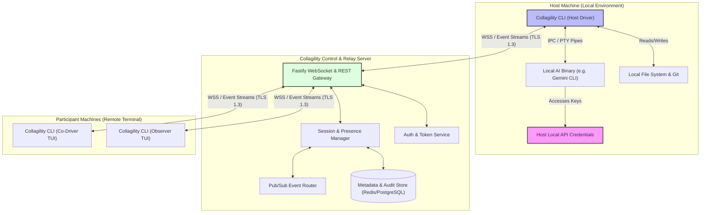

---

## 3. High-Level Architecture

The platform architecture is divided into three primary tiers: **Client CLI Monorepo Applications**, **Relay Control Plane**, and **Persistence / Message Fabric**.

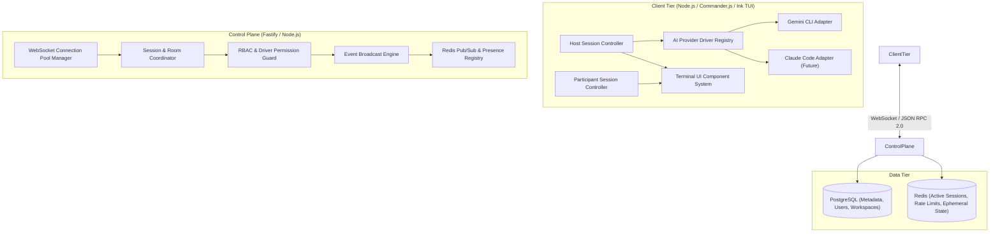

---

## 4. Core Architectural Principles

1. **AI Execution Locality:** AI execution, model inferencing, credential management, and workspace manipulation occur exclusively on the host developer's machine.
2. **Zero-Knowledge Backend:** The backend control plane routes collaboration frames but never stores, inspects, or proxies LLM API requests or response context data.
3. **Hexagonal Provider Abstraction:** The CLI abstracts AI engines behind unified domain ports (`IAgentDriver`). Introducing a new AI provider requires implementing a driver adapter without changing application domain logic.
4. **Stateless Scale-Out:** The Fastify server nodes maintain no sticky local memory state. All session routing, room memberships, and presence states are synchronized over a distributed Redis Pub/Sub fabric.
5. **Host Sovereignty & Explicit Approval:** The host CLI retains absolute authority over the local environment. Remote participant actions (prompts, suggestions) are bounded by host permission policies and require explicit host confirmation for state mutations.

---

## 5. Major Components

### 5.1 CLI Application (`@collagility/cli`)
* **TUI Renderer:** Custom terminal interface built using Commander.js and React/Ink for rich ANSI rendering, side-chats, diff previews, and presence bars.
* **Host Engine:** Coordinates local AI process creation, stdout/stderr streaming, prompt input forwarding, and command approval loops.
* **Participant Engine:** Manages participant connection state, renders live stream buffers, and dispatches out-of-band chat/co-prompt payloads.
* **Driver Abstraction Module:** Implements the Ports & Adapters layer for local AI binaries (Gemini CLI, Claude Code, Aider, Goose).

### 5.2 Server Control Plane (`@collagility/server`)
* **Fastify HTTP/WS Server:** Provides low-overhead HTTP REST endpoints for authentication/session bootstrapping and WebSocket upgrades for real-time streams.
* **Session & Room Manager:** Enforces workspace membership, room lifecycle (create, join, leave, destroy), and participant roles (Host, Co-Driver, Observer).
* **Presence & Heartbeat Monitor:** Tracks real-time participant availability, active focus, and network latency metrics using Redis key expirations.
* **Event Multiplexer & Broadcast Engine:** Filters and fans out incoming session events to authorized room participants with sub-50ms latency.

### 5.3 Shared Core Libraries (`@collagility/core`, `@collagility/protocol`)
* **Protocol Definitions:** Shared TypeScript interfaces, JSON schemas, and RPC message specifications for WebSocket frames.
* **Domain Models:** Core entity definitions (Session, Participant, Workspace, EventFrame, AgentState).

---

## 6. Component Responsibilities

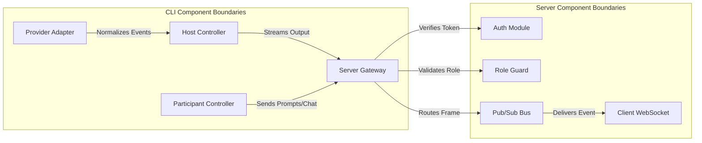

| Component | Primary Responsibility | Key Interfaces / Dependencies |
| :--- | :--- | :--- |
| **TUI Renderer** | Renders ANSI stream, chat, presence bar, and modals. | React/Ink, ANSI Escapes |
| **Driver Adapter Engine** | Wraps local AI process stdio; translates provider events into unified format. | Node.js `child_process` / `pty`, `IAgentDriver` |
| **Fastify WS Gateway** | Manages WebSocket connections, heartbeats, and frame demuxing. | `@fastify/websocket`, `ws` |
| **Room & Session Manager** | Maintains in-memory & Redis room state, participant lists, and role policies. | Redis, PostgreSQL, `@collagility/core` |
| **Auth & Security Guard** | Validates JWT tokens, workspace access permissions, and rate limits. | `@fastify/jwt`, Argon2 |

---

## 7. Deployment Architecture

The deployment architecture is fully containerized using Docker and horizontally scalable across cloud environments (AWS ECS / Kubernetes / GCP Cloud Run).

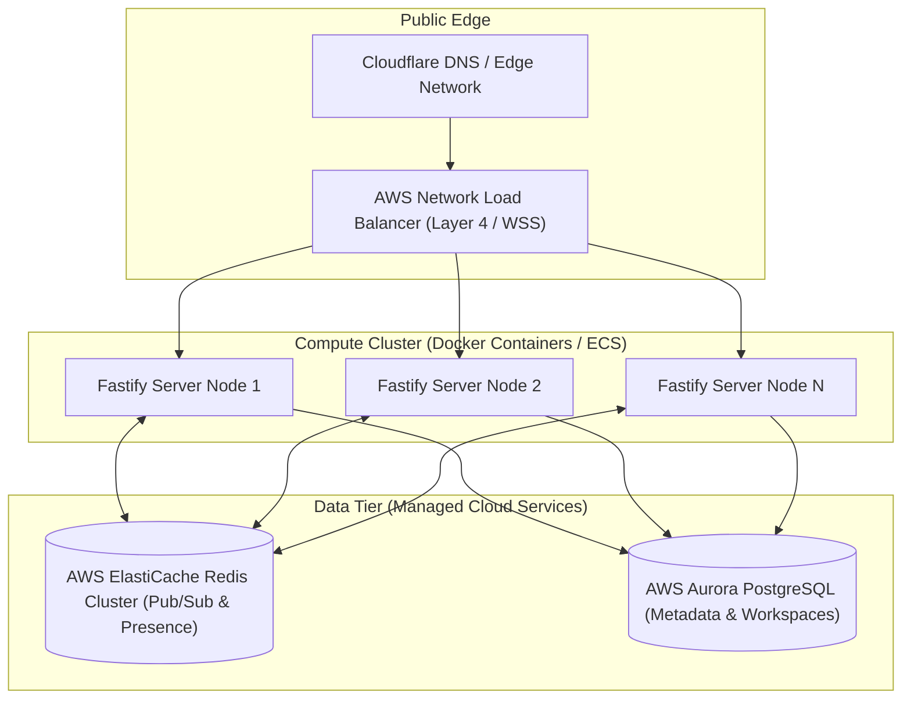

---

## 8. Layered Architecture

The application is structured into four distinct logical layers, enforcing strict unidirectional dependencies downwards.

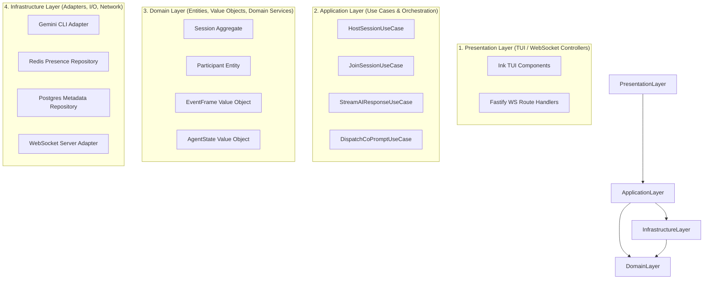

---

## 9. Clean Architecture

Clean Architecture ensures that central domain logic remains independent of UI frameworks, external AI CLI tools, database drivers, and network protocols.

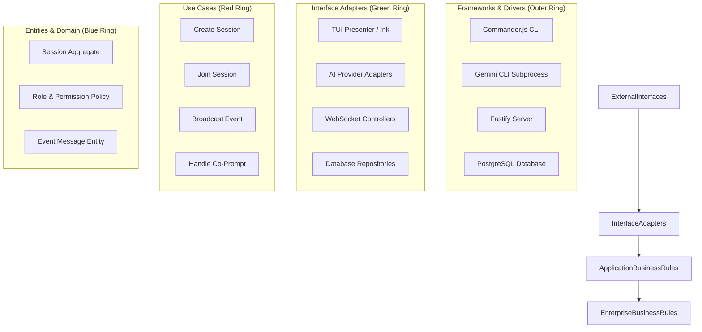

---

## 10. Hexagonal (Ports & Adapters) Architecture

Hexagonal architecture abstracts AI provider interaction and server communication behind explicit input and output ports.

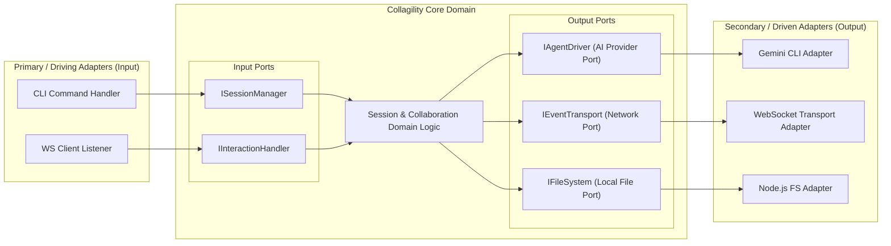

---

## 11. Adapter Pattern for AI Providers

To support multiple AI tools (Gemini CLI initially, Claude Code, OpenAI Codex CLI, Aider, Goose in the future), the CLI defines a clean `IAgentDriver` port.

```mermaid
graph TD
    subgraph Domain Engine
        HostEngine["Host Engine Core"]
        DriverRegistry["Driver Registry & Factory"]
    end

    subgraph Provider Port ["Port Interface"]
        IAgentDriver["IAgentDriver Interface"]
    end

    subgraph Provider Adapters ["Concrete Adapters"]
        GeminiDriver["GeminiCLIAdapter"]
        ClaudeDriver["ClaudeCodeAdapter"]
        CodexDriver["OpenAICodexAdapter"]
        GooseDriver["GooseAdapter"]
    end

    subgraph Native Processes ["Local System Processes"]
        GeminiBin["gemini executable"]
        ClaudeBin["claude executable"]
        CodexBin["codex executable"]
        GooseBin["goose executable"]
    end

    HostEngine --> DriverRegistry
    DriverRegistry --> IAgentDriver
    IAgentDriver <|.. GeminiDriver
    IAgentDriver <|.. ClaudeDriver
    IAgentDriver <|.. CodexDriver
    IAgentDriver <|.. GooseDriver

    GeminiDriver <-->|"Stdio / IPC Hooks"| GeminiBin
    ClaudeDriver <-->|"Stdio / PTY Stream"| ClaudeBin
    CodexDriver <-->|"Stdio Stream"| CodexBin
    GooseDriver <-->|"Stdio / IPC Hooks"| GooseBin
```

### 11.1 Provider Interface Contract (`IAgentDriver`)
The driver contract requires adapters to implement standard methods:
* `initialize(config: DriverConfig): Promise<void>`
* `sendPrompt(prompt: string, context?: ContextPayload): Promise<void>`
* `streamResponse(): AsyncIterable<AgentEventFrame>`
* `interrupt(): Promise<void>`
* `terminate(): Promise<void>`

---

## 12. Domain Boundaries

Using Domain-Driven Design (DDD), the system is divided into four distinct bounded contexts:

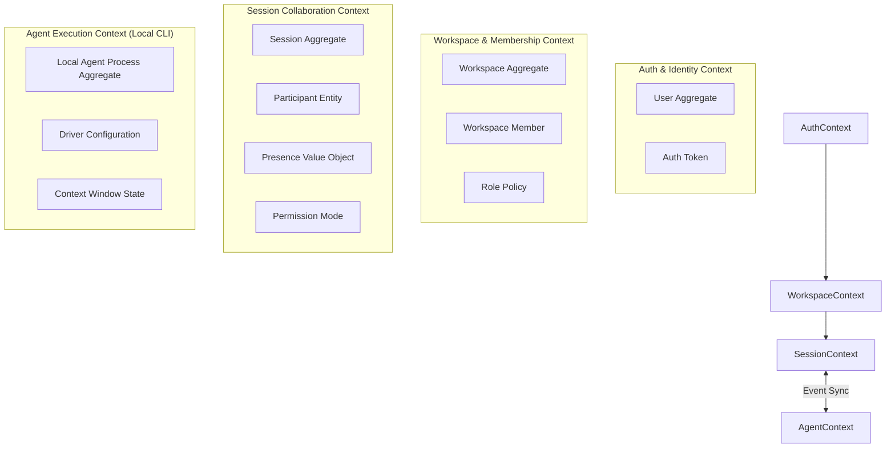

---

## 13. Monorepo Structure

The codebase is organized as a lightweight pnpm monorepo:

```
collagility/
├── apps/
│   ├── cli/                   # Commander.js & Ink TUI application (@collagility/cli)
│   └── server/                # Fastify WebSocket control plane (@collagility/server)
├── packages/
│   ├── core/                  # Domain entities, use cases, interfaces (@collagility/core)
│   ├── protocol/              # WebSocket JSON-RPC schemas & frames (@collagility/protocol)
│   ├── drivers/               # AI Provider adapters (Gemini, Claude, etc.) (@collagility/drivers)
│   └── config/                # Shared ESLint, TypeScript, and build configs (@collagility/config)
├── docker/
│   ├── Dockerfile.server      # Server production container build
│   └── docker-compose.yml     # Local dev orchestration (Server + Redis + Postgres)
├── pnpm-workspace.yaml
└── package.json
```

---

## 14. Module Responsibilities

| Package / Module | Scope & Responsibility |
| :--- | :--- |
| `apps/cli` | Handles CLI entrypoint arguments (`host`, `join`), terminal UI rendering (Ink), stdin/stdout management, local process spawning. |
| `apps/server` | Handles REST API endpoints, WebSocket connection upgrades, room state routing, rate limiting, and Redis Pub/Sub multiplexing. |
| `packages/core` | Contains core domain models (`Session`, `Participant`), permission policies, use case interfaces, and validation rules. |
| `packages/protocol` | Defines type-safe event frames, payload serialization rules, and binary delta encoding utilities. |
| `packages/drivers` | Implements provider adapters (e.g., `GeminiCLIAdapter`) implementing `IAgentDriver`. |

---

## 15. Communication Model

Collagility utilizes a hybrid communication architecture:
* **REST HTTP (JSON):** Used strictly for authentication, user registration, workspace creation, and session token issuance.
* **WebSockets (JSON-RPC 2.0 / Binary Frames):** Used for all real-time bidirectional session multiplexing, AI event streaming, presence heartbeats, and chat.

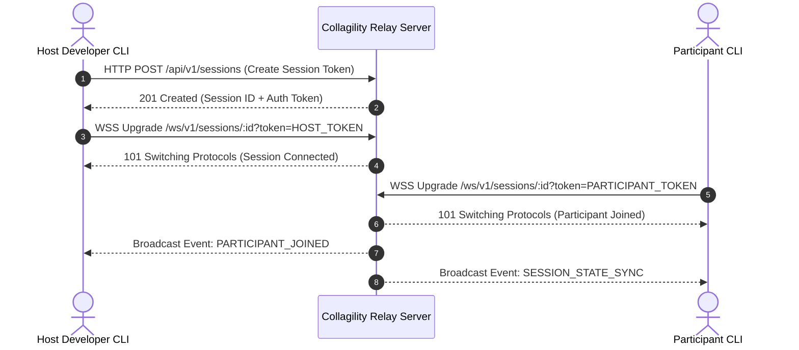

---

## 16. Data Flow

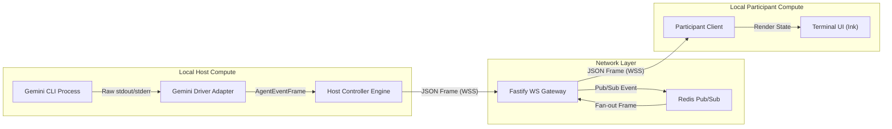

---

## 17. Event Flow

Every event broadcast through the Collagility network is wrapped in a standardized `EventFrame`:

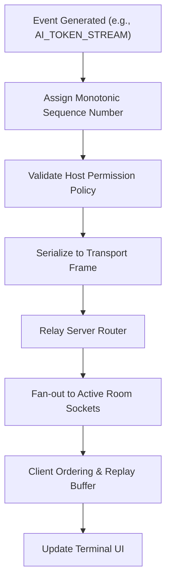

---

## 18. Request Flow

```mermaid
sequenceDiagram
    autonumber
    actor Participant as Participant CLI
    participant Server as Relay Server
    actor Host as Host CLI
    participant LocalAI as Local Gemini CLI

    Participant->>Server: WS Send: CO_PROMPT_REQUEST (Prompt: "Fix null check")
    Server->>Server: Verify Participant Role == CoDriver
    Server->>Host: WS Forward: CO_PROMPT_REQUEST
    Host->>Host: Host TUI Prompt Approval Dialog (Approved)
    Host->>LocalAI: Inject Prompt into Local Process Stdin
    LocalAI-->>Host: Stream Response Tokens
    Host->>Server: WS Stream: AGENT_STREAM_CHUNK (Token delta)
    Server->>Participant: WS Broadcast: AGENT_STREAM_CHUNK
```

---

## 19. Authentication Flow

Authentication uses standard JWT tokens bound to workspace memberships.

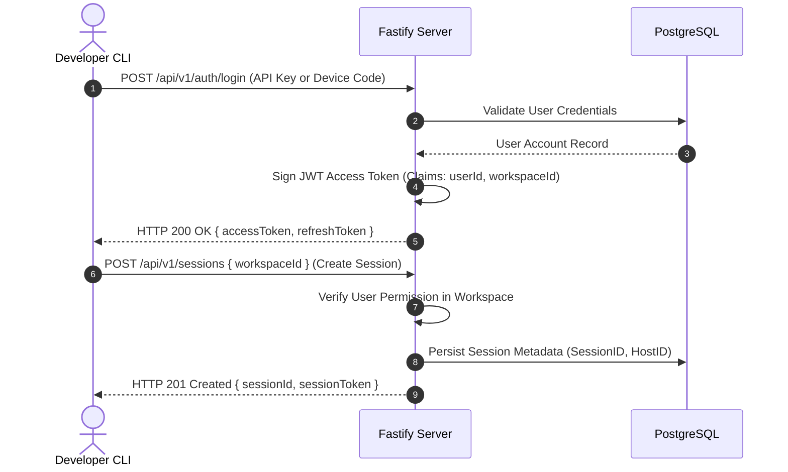

---

## 20. WebSocket Lifecycle

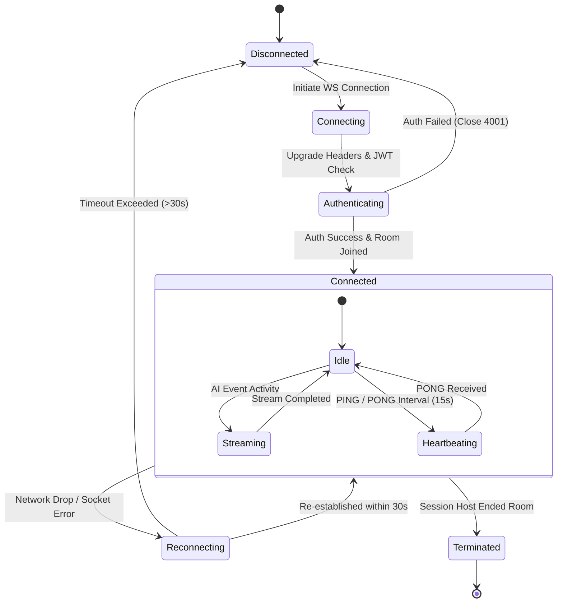

---

## 21. Session Lifecycle

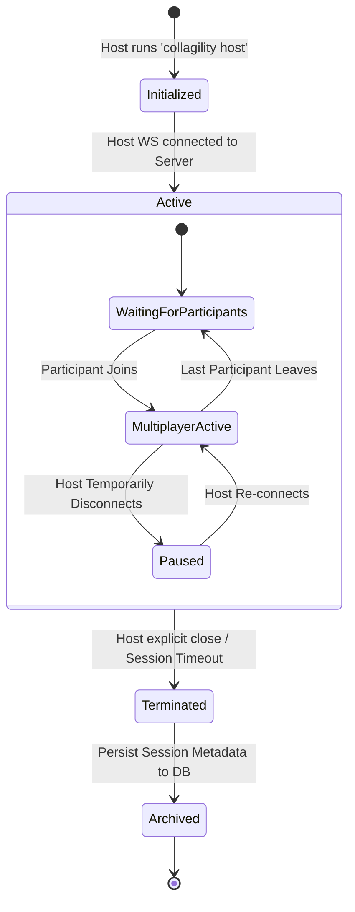

---

## 22. Collaboration Lifecycle

```mermaid
sequenceDiagram
    autonumber
    actor Host as Session Host
    actor Participant as Participant
    participant Server as Relay Server

    Host->>Server: SET_PERMISSION_MODE { participantId, role: "CoDriver" }
    Server-->>Participant: ROLE_UPDATED { newRole: "CoDriver" }

    Participant->>Server: SUBMIT_PROMPT_SUGGESTION { text: "Add unit tests" }
    Server-->>Host: PROMPT_SUGGESTED { suggestionId, from: Participant }
    
    alt Host Approves Suggestion
        Host->>Server: RESOLVE_SUGGESTION { suggestionId, status: "APPROVED" }
        Server-->>Participant: SUGGESTION_RESOLVED { status: "APPROVED" }
    else Host Rejects Suggestion
        Host->>Server: RESOLVE_SUGGESTION { suggestionId, status: "REJECTED" }
        Server-->>Participant: SUGGESTION_RESOLVED { status: "REJECTED" }
    end
```

---

## 23. Error Handling Strategy

1. **Local AI Execution Errors:** If the local AI agent crashes or returns an exit code $\ne 0$, the host CLI captures `stderr`, encapsulates it in an `AGENT_ERROR` event frame, and streams it to participants while keeping the session alive.
2. **Network Disconnections:** The CLI implements a local circular ring-buffer storing the last 500 event frames. When a participant reconnects after a transient network drop, the client sends a `SYNC_REQUEST` with its last received sequence number (`lastSeq`), and the server/host replays missed frames.
3. **Malicious / Invalid Frame Protection:** Server role guards drop unauthorized requests (e.g., an Observer attempting to submit prompts) and issue a `PROTOCOL_ERROR` frame without crashing the room socket.

---

## 24. Scalability Strategy

* **Horizontal Scale-Out:** Fastify server nodes are stateless. Rooms are distributed across any available node in the cluster.
* **Redis Pub/Sub Messaging:** When an event is published by a host on Node A, Node A publishes the frame to `redis.publish("room:SESSION_ID", frame)`. Node B (holding socket connections for Participants in that room) consumes the message and forwards it down its local sockets.
* **Low-Memory Footprint:** Each active socket connection consumes $< 15\text{ KB}$ memory overhead in Node.js. A single Fastify container instance can maintain $20,000+$ concurrent connected participants.

---

## 25. Reliability & Fault Tolerance

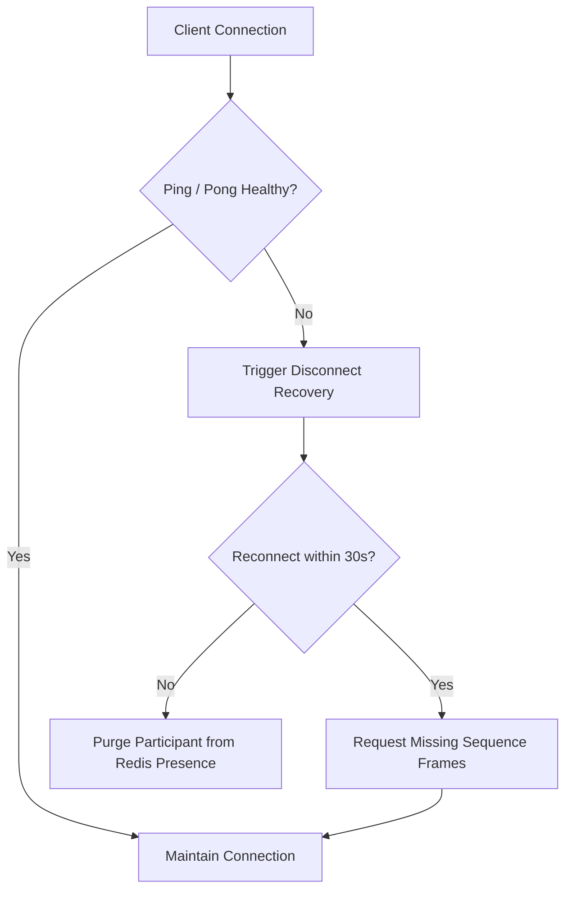

---

## 26. Security Architecture

1. **Zero-Trust AI Key Containment:** API keys for Gemini, Anthropic, or OpenAI are NEVER transmitted over the wire or stored on the Collagility backend.
2. **Host sovereignty & Input Sanitization:** Remote participant prompt suggestions cannot directly execute commands on the host OS. All command executions require manual host approval via interactive TUI dialogs.
3. **Transport Security:** All client-to-server traffic enforces TLS 1.3 encryption (`wss://`).
4. **Token Isolation:** Session tokens are short-lived, cryptographically random, and scoped tightly to specific session IDs and user identities.

---

## 27. Observability (Logging, Metrics, Tracing)

* **Structured Logging:** Fastify uses Pino for high-performance JSON logging with context fields (`sessionId`, `userId`, `traceId`).
* **Prometheus Metrics:** Fastify exports metrics covering active WebSocket connections, message routing latency, Pub/Sub fanout counts, and system CPU/RAM usage.
* **Distributed Tracing:** OpenTelemetry instrumentation across HTTP endpoints, WebSocket connections, and Redis operations.

---

## 28. Deployment Strategy

* **Container Infrastructure:** Built as lightweight multi-stage Docker containers using Node.js Alpine base images.
* **Infrastructure as Code (IaC):** Terraform scripts provision AWS ECS Fargate clusters, ElastiCache Redis clusters, and Aurora PostgreSQL instances.
* **CI/CD Pipeline:** GitHub Actions automates linting, unit/integration testing, container compilation, and blue/green zero-downtime cluster deployments.

---

## 29. Tradeoffs and Architectural Decisions

| Decision | Option Chosen | Alternative Considered | Rationale for Choice |
| :--- | :--- | :--- | :--- |
| **Backend AI Handling** | Local Execution Only | Central AI Proxying | Eliminates cloud API key liability, respects code privacy, and drastically reduces server cost. |
| **Transport Layer** | WebSockets (Fastify) | gRPC Web / WebRTC | WebSockets offer universal terminal client compatibility, standard proxy traversal, and simpler fallback handling. |
| **Monorepo Tooling** | pnpm Workspaces | Lerna / Nx | pnpm provides superior disk utilization, strict package isolation, and fast installation speeds. |
| **Terminal UI Layer** | Ink (React for CLI) | Raw Blessed / Curses | Ink allows declarative, component-driven UI architecture in TypeScript with fast layout calculations. |

---

## 30. Future Expansion Roadmap

1. **Phase 1 (MVP):** Launch core CLI, Fastify server, Gemini CLI driver adapter, and basic TUI session multiplexing.
2. **Phase 2 (Multi-Agent Support):** Implement Claude Code adapter, OpenAI Codex CLI adapter, and Goose integration via the `IAgentDriver` port.
3. **Phase 3 (Zero-Trust E2EE):** Add end-to-end payload encryption using WebRTC / Noise Protocol key exchanges between clients, rendering the relay server incapable of inspecting session content.
4. **Phase 4 (Session Playback & Analytics):** Implement deterministic session event log recording for offline asynchronous code reviews and team onboarding.

---
