# RFC-0003: Real-Time WebSocket Communication Protocol Specification

**Title:** Collagility Protocol Specification (v1.0.0-draft)  
**Author:** Staff Software Architect  
**Status:** Draft / Proposal  
**Created:** July 2026  
**Target Clients:** CLI, Browser, Desktop, VS Code Extension, JetBrains Plugin, Native SDKs  

---

## 1. Executive Overview

This document specifies the formal real-time WebSocket protocol (`collagility-v1`) for **Collagility**, the open-source multiplayer workspace for local AI coding agents. 

The protocol establishes a standardized, client-agnostic binary and JSON messaging wire format connecting local client instances (Hosts, Co-Drivers, Observers) through stateless relay nodes. It governs session initialization, bidirectional stream multiplexing, presence synchronization, out-of-band chat, permission authorization, and offline state recovery.

The protocol strictly maintains Collagility's local-first security architecture: **all AI prompt execution and model credential handling remain isolated to the session host**. The relay server operates purely as an event router, validating envelope headers, verifying role permissions, and fanning out self-describing event frames to active session participants.

---

## 2. Protocol Philosophy

1. **Client-Agnostic Core:** The protocol makes zero assumptions about terminal UI, browser DOM, or IDE extension internals. CLI, Web, and IDE clients interact through identical event schemas.
2. **Zero-Trust Relay Neutrality:** Protocol payloads never contain raw AI API keys, LLM authorization headers, or sensitive environment secrets.
3. **Explicit Semantic Event Taxonomy:** All messages follow a strict `domain.entity.action` namespace (e.g., `ai.stream.chunk`, `session.participant.joined`).
4. **Resilient Event Stream Monotonicity:** Every event frame carries a monotonically increasing 64-bit sequence number (`seq`), ensuring strict total ordering, gap detection, and deterministic offline replay.
5. **Extensible Envelope Contract:** The envelope guarantees forward and backward compatibility via protocol versioning, feature negotiation flags, and structured metadata properties.

---

## 3. Protocol Architecture

The protocol operates over persistent WebSockets using TLS 1.3 (`wss://`). Messages are exchanged as text frames formatted as UTF-8 encoded JSON objects. Future iterations may negotiate binary WebSocket frames (Protocol Buffers / FlatBuffers) via feature negotiation without altering semantic message definitions.

```
+-----------------------------------------------------------------------------------+
|                              COMMON MESSAGE ENVELOPE                              |
|                                                                                   |
|  +--------------------+---------------------+----------------------------------+  |
|  | Protocol Header    | Message Metadata    | Routing & Identity               |  |
|  | - version: "1.0"   | - id: UUIDv4        | - session_id: UUIDv4             |  |
|  | - event: STRING    | - timestamp: INT64  | - workspace_id: UUIDv4           |  |
|  | - type: STRING     | - correlation_id    | - sender_id: UUIDv4              |  |
|  | - seq: UINT64      | - request_id        | - sender_role: STRING            |  |
|  +--------------------+---------------------+----------------------------------+  |
|                                                                                   |
|  +-----------------------------------------------------------------------------+  |
|  |                              PAYLOAD SECTION                                |  |
|  |                                                                             |  |
|  |  Event-Specific Structured Data (JSON Object adhering to event schema)      |  |
|  +-----------------------------------------------------------------------------+  |
+-----------------------------------------------------------------------------------+
```

---

## 4. Message Envelope

Every message transmitted across the Collagility protocol MUST conform to the standard top-level JSON envelope.

```json
{
  "version": "1.0",
  "id": "f47ac10b-58cc-4372-a567-0e02b2c3d479",
  "event": "ai.stream.chunk",
  "type": "EVENT",
  "seq": 1042,
  "timestamp": 1774900000123,
  "correlation_id": "9b1deb4d-3b7d-4bad-9bdd-2b0d7b3dcb6d",
  "request_id": "req_8f12a3b",
  "session_id": "c1a2b3c4-d5e6-7f8a-9b0c-1d2e3f4a5b6c",
  "workspace_id": "w1a2b3c4-d5e6-7f8a-9b0c-1d2e3f4a5b6c",
  "sender": {
    "user_id": "usr_99887766",
    "role": "HOST",
    "client_type": "CLI"
  },
  "metadata": {
    "client_version": "0.1.0",
    "trace_id": "0af7651916cd43dd8448eb211c80319c"
  },
  "payload": {}
}
```

---

## 5. Standard Event Structure

### Envelope Field Definitions

| Field Name | Type | Required | Description |
| :--- | :--- | :--- | :--- |
| `version` | `string` | **Yes** | Protocol version string (e.g., `"1.0"`). |
| `id` | `string` | **Yes** | Unique UUIDv4 string for this message instance. |
| `event` | `string` | **Yes** | Dot-delimited event name following `domain.entity.action` format. |
| `type` | `enum` | **Yes** | Message archetype: `"REQUEST"`, `"RESPONSE"`, `"EVENT"`, `"ERROR"`. |
| `seq` | `uint64` | **Yes** | Monotonic sequence number scoped to the session stream. |
| `timestamp` | `int64` | **Yes** | UTC Unix timestamp in milliseconds. |
| `correlation_id` | `string` | No | ID linking multiple events in a single async workflow. |
| `request_id` | `string` | No | RPC request ID matching a client request to server response. |
| `session_id` | `string` | **Yes** | Scoped session identifier UUIDv4. |
| `workspace_id` | `string` | **Yes** | Scoped workspace identifier UUIDv4. |
| `sender` | `object` | **Yes** | Sender metadata object containing `user_id`, `role`, and `client_type`. |
| `metadata` | `object` | No | Key-value store for telemetry, trace IDs, and client capabilities. |
| `payload` | `object` | **Yes** | Event-specific JSON payload conforming to the event schema. |

---

## 6. Connection Lifecycle

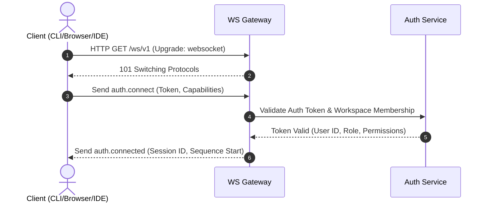

---

## 7. Authentication Flow

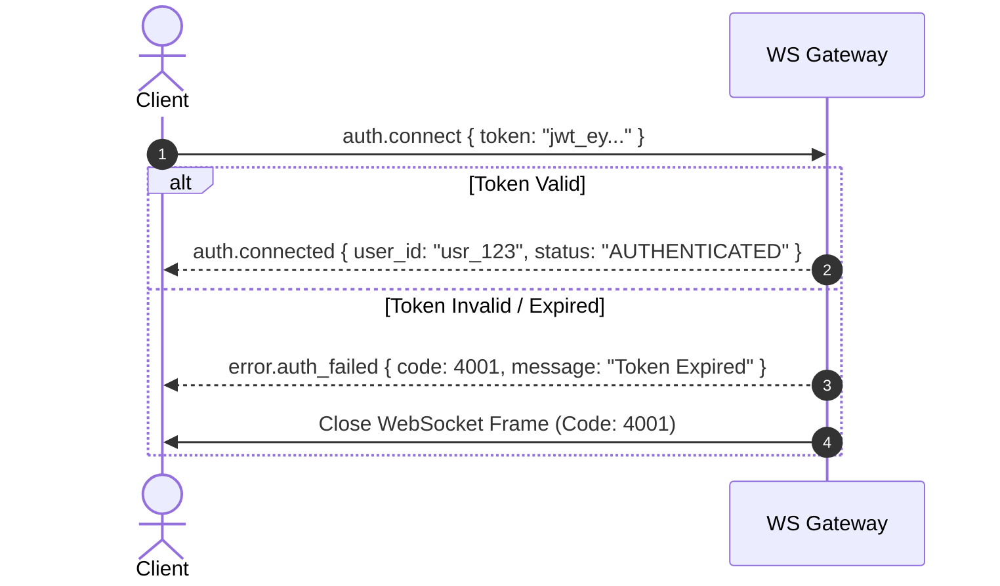

---

## 8. Session Creation

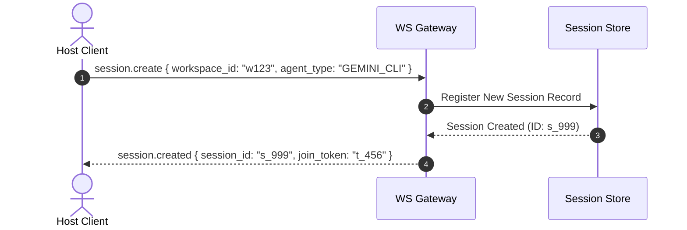

---

## 9. Session Join

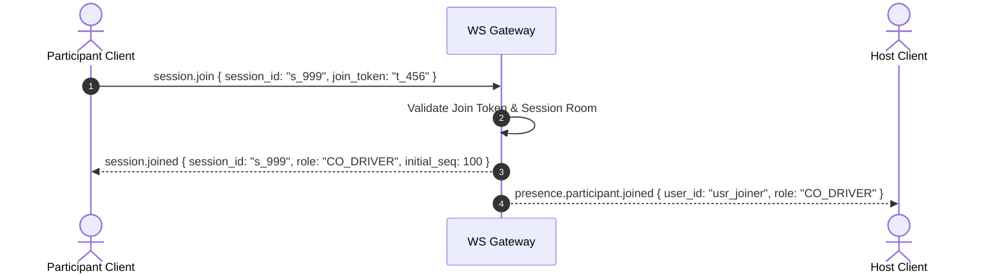

---

## 10. Session Leave

```mermaid
sequenceDiagram
    autonumber
    actor Participant as Participant Client
    participant Server as WS Gateway
    actor Host as Host Client

    Participant->>Server: session.leave { session_id: "s_999" }
    Server-->>Participant: session.left { session_id: "s_999", status: "DISCONNECTED" }
    Server-->>Host: presence.participant.left { user_id: "usr_participant" }
    Server->>Participant: Close WebSocket Frame (Normal Closure 1000)
```

---

## 11. Heartbeat Protocol

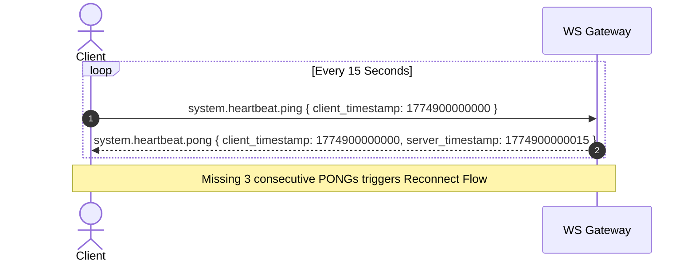

---

## 12. Presence Protocol

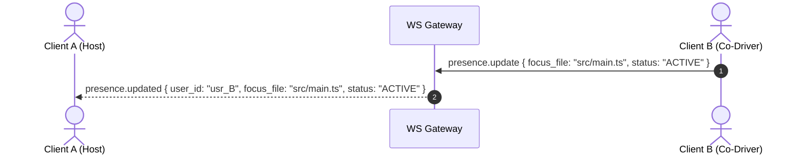

---

## 13. Chat Events

```mermaid
sequenceDiagram
    autonumber
    actor Participant as Co-Driver
    participant Server as WS Gateway
    actor Host as Host Client

    Participant->>Server: chat.message.send { content: "Should we handle exceptions here?" }
    Server->>Server: Persist Message to Audit Stream
    Server-->>Host: chat.message.broadcast { message_id: "m_1", sender: "usr_B", content: "..." }
    Server-->>Participant: chat.message.broadcast { message_id: "m_1", sender: "usr_B", content: "..." }
```

---

## 14. AI Request Events

```mermaid
sequenceDiagram
    autonumber
    actor Participant as Co-Driver
    participant Server as WS Gateway
    actor Host as Host Client

    Participant->>Server: ai.request.suggest_prompt { prompt: "Refactor function to async/await" }
    Server->>Server: Verify Role Permissions (CoDriver allowed)
    Server-->>Host: ai.request.prompt_suggested { suggestion_id: "sug_01", prompt: "..." }
```

---

## 15. AI Response Events

```mermaid
sequenceDiagram
    autonumber
    actor Host as Host Client
    participant Server as WS Gateway
    actor Participant as Co-Driver

    Host->>Host: Execute Local AI Agent
    Host->>Server: ai.response.completed { prompt_id: "req_1", status: "SUCCESS", tokens_used: 450 }
    Server-->>Participant: ai.response.completed { prompt_id: "req_1", status: "SUCCESS", tokens_used: 450 }
```

---

## 16. AI Streaming Events

```mermaid
sequenceDiagram
    autonumber
    actor Host as Host Client
    participant Server as WS Gateway
    actor Participant as Participant Client

    loop Token Chunk Generation
        Host->>Server: ai.stream.chunk { stream_id: "st_1", delta: "function ", chunk_index: 1 }
        Server-->>Participant: ai.stream.chunk { stream_id: "st_1", delta: "function ", chunk_index: 1 }
    end
    Host->>Server: ai.stream.end { stream_id: "st_1", total_chunks: 42 }
    Server-->>Participant: ai.stream.end { stream_id: "st_1", total_chunks: 42 }
```

---

## 17. Collaboration Events

```mermaid
sequenceDiagram
    autonumber
    actor Host as Host Client
    participant Server as WS Gateway
    actor Participant as Co-Driver

    Host->>Server: collaboration.driver.yield { target_user_id: "usr_B" }
    Server-->>Participant: collaboration.driver.assigned { user_id: "usr_B", active_driver: true }
    Server-->>Host: collaboration.driver.assigned { user_id: "usr_B", active_driver: false }
```

---

## 18. File Synchronization Events

```mermaid
sequenceDiagram
    autonumber
    actor Host as Host Client
    participant Server as WS Gateway
    actor Participant as Participant Client

    Host->>Server: file.diff.updated { file_path: "src/index.ts", diff: "@@ -1,3 +1,4 @@..." }
    Server-->>Participant: file.diff.updated { file_path: "src/index.ts", diff: "@@ -1,3 +1,4 @@..." }
```

---

## 19. Permission Events

```mermaid
sequenceDiagram
    autonumber
    actor Host as Host Client
    participant Server as WS Gateway
    actor Participant as Target Participant

    Host->>Server: permission.update { target_user_id: "usr_B", new_role: "OBSERVER" }
    Server->>Server: Update Room Role Table
    Server-->>Participant: permission.updated { user_id: "usr_B", role: "OBSERVER" }
```

---

## 20. Notification Events

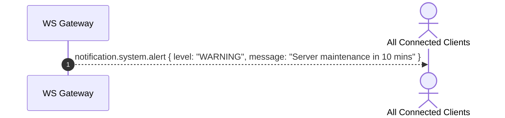

---

## 21. System Events

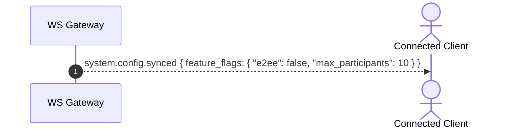

---

## 22. Error Events

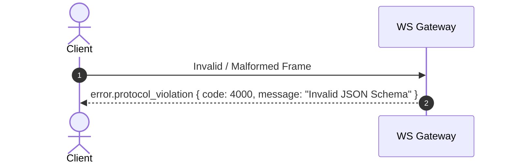

---

## 23. Reconnection Strategy

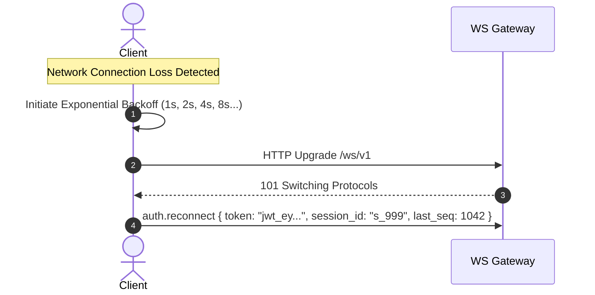

---

## 24. Offline Recovery

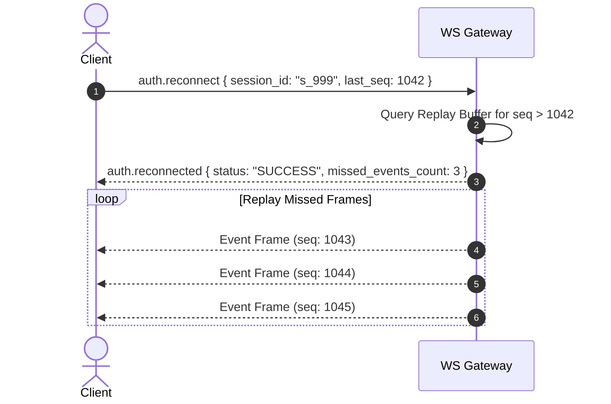

---

## 25. Event Ordering

* **Monotonic Sequence Guarantee:** All server-relayed messages carry a strict uint64 `seq` value incremented per room session.
* **Client Buffer & Sorting:** Clients maintain a sparse min-heap ordering buffer. If a frame arrives with `seq = 1045` when `last_received_seq = 1042`, the client buffers frames `1045` and dispatches a gap-fill `sync.replay.request { start_seq: 1043, end_seq: 1044 }`.

---

## 26. Message Correlation

Asynchronous request-response pairs carry matching `request_id` and `correlation_id` parameters in their headers:
* `request_id`: Binds a direct RPC response (e.g., `session.create` $\rightarrow$ `session.created`).
* `correlation_id`: Groups long-running multi-stage workflows (e.g., a co-prompt suggestion $\rightarrow$ host approval $\rightarrow$ AI execution stream $\rightarrow$ response completion).

---

## 27. Idempotency Strategy

* Every event carries a unique `id` (UUIDv4).
* Clients and servers maintain a deduplication cache of processed message IDs (TTL = 5 minutes).
* If a duplicate `id` is received due to TCP network re-transmissions, the frame is acknowledged and silently ignored without re-triggering business logic.

---

## 28. Event Naming Convention

All event names follow dot-delimited lowercase taxonomy: `<domain>.<entity>.<action>`

### Standard Domains:
* `auth.*` - Authentication & socket session handshake
* `session.*` - Room lifecycle & configuration
* `presence.*` - Participant status & cursor focus
* `chat.*` - Out-of-band human communication
* `ai.*` - Prompt requests, responses, and token streams
* `file.*` - Workspace diffs & file updates
* `collaboration.*` - Driver yields & co-prompting
* `permission.*` - Role updates & ACL management
* `system.*` - Heartbeats, feature negotiation, maintenance

---

## 29. Event Versioning

Events contain an explicit `version` string in their header (default `"1.0"`). When an event schema evolves:
* **Minor Non-Breaking Field Addition:** Retains `version: "1.0"`. Added properties are declared optional.
* **Major Breaking Changes:** Bumps event payload version (e.g., `"2.0"`). Clients reject unhandled major event versions gracefully.

---

## 30. Protocol Versioning

The protocol version is negotiated during the initial `auth.connect` handshake via the `version` field. The current protocol specification version is `1.0.0`.

---

## 31. Feature Negotiation

During connection initialization, clients send supported capability flags in `auth.connect`:

```json
{
  "capabilities": {
    "binary_compression": true,
    "delta_diffs": true,
    "max_payload_mb": 10
  }
}
```

The server returns intersecting enabled capabilities in `auth.connected`.

---

## 32. Forward Compatibility

* Servers and clients MUST ignore unrecognized JSON properties in payloads.
* Clients MUST NOT throw runtime exceptions when receiving unknown event names; unknown events are logged and dropped.

---

## 33. Backward Compatibility

* Field deprecations require a minimum 6-month deprecation lifecycle.
* Deprecated payload fields are marked with `deprecated: true` in schema definitions but retained in wire output until major protocol version upgrades.

---

## 34. Security Considerations

1. **Strict Key Containment:** Payloads MUST NEVER contain API tokens or credentials for AI vendors.
2. **Role-Based Event Filtering:** The server validates that non-host clients cannot emit restricted event types (e.g., `ai.stream.chunk` or `permission.update`).
3. **Payload Size Caps:** Server drops WebSocket frames exceeding 2 MB to prevent memory exhaustion / DoS attacks.

---

## 35. Performance Considerations

1. **Delta Stream Encoding:** Token streaming events (`ai.stream.chunk`) send minimal string deltas rather than full accumulated buffers.
2. **Sub-50ms Routing:** The relay server uses non-blocking JSON parsing and direct memory pointer references for room fanout.

---

## 36. Best Practices

* Use `correlation_id` across all related events in a workflow for simplified log tracing.
* Always handle `error.*` events gracefully with UI notification banners rather than crashing the client process.

---

## 37. Future Extensions

* **Binary Protocol Buffers:** Support for `.proto` wire encoding over binary WebSockets.
* **Peer-to-Peer Data Channels:** WebRTC data channel fallback for low-latency peer media streaming.

---

## 38. Event Documentation

### 38.1 Connection & Auth Family

#### 1. `auth.connect`
* **Purpose:** Initiate connection handshake and supply JWT token.
* **Direction:** Client $\rightarrow$ Server
* **When Sent:** Immediately upon WebSocket connection open.
* **Required Fields:** `token`
* **Optional Fields:** `capabilities`
* **JSON Schema:**
```json
{
  "type": "object",
  "properties": {
    "token": { "type": "string" },
    "capabilities": {
      "type": "object",
      "properties": {
        "binary_compression": { "type": "boolean" },
        "delta_diffs": { "type": "boolean" }
      }
    }
  },
  "required": ["token"]
}
```
* **Expected Server Behavior:** Validates JWT token; associates socket with user account; returns `auth.connected` or `error.auth_failed`.
* **Expected Client Behavior:** Awaits `auth.connected` before dispatching session commands.

---

#### 2. `auth.connected`
* **Purpose:** Acknowledge successful handshake.
* **Direction:** Server $\rightarrow$ Client
* **When Sent:** After successful token validation.
* **Required Fields:** `user_id`, `status`
* **Optional Fields:** `active_sessions`
* **JSON Schema:**
```json
{
  "type": "object",
  "properties": {
    "user_id": { "type": "string" },
    "status": { "type": "string", "enum": ["AUTHENTICATED"] },
    "active_sessions": {
      "type": "array",
      "items": { "type": "string" }
    }
  },
  "required": ["user_id", "status"]
}
```
* **Expected Server Behavior:** Sets socket state to authenticated.
* **Expected Client Behavior:** Enables session creation or session join actions.

---

### 38.2 Session Lifecycle Family

#### 3. `session.create`
* **Purpose:** Host requests creation of a new multiplayer room session.
* **Direction:** Client $\rightarrow$ Server
* **When Sent:** When developer runs `collagility host`.
* **Required Fields:** `workspace_id`, `agent_type`
* **Optional Fields:** `session_name`, `permission_mode`
* **JSON Schema:**
```json
{
  "type": "object",
  "properties": {
    "workspace_id": { "type": "string" },
    "agent_type": { "type": "string", "enum": ["GEMINI_CLI", "CLAUDE_CODE", "CODEX_CLI"] },
    "session_name": { "type": "string" },
    "permission_mode": { "type": "string", "enum": ["CO_DRIVER", "OBSERVER_ONLY"] }
  },
  "required": ["workspace_id", "agent_type"]
}
```
* **Expected Server Behavior:** Generates room record in DB/Redis; registers sender as HOST; returns `session.created`.
* **Expected Client Behavior:** Displays session join URL / session ID in TUI.

---

#### 4. `session.join`
* **Purpose:** Join an active room session.
* **Direction:** Client $\rightarrow$ Server
* **When Sent:** When participant runs `collagility join <session-id>`.
* **Required Fields:** `session_id`, `join_token`
* **Optional Fields:** `initial_role`
* **JSON Schema:**
```json
{
  "type": "object",
  "properties": {
    "session_id": { "type": "string" },
    "join_token": { "type": "string" }
  },
  "required": ["session_id", "join_token"]
}
```
* **Expected Server Behavior:** Validates join token; binds socket to room; broadcasts `presence.participant.joined` to room.
* **Expected Client Behavior:** Initializes TUI view and syncs sequence buffer.

---

### 38.3 AI Execution & Streaming Family

#### 5. `ai.request.suggest_prompt`
* **Purpose:** Participant suggests an input prompt to the host's AI session.
* **Direction:** Client $\rightarrow$ Server
* **When Sent:** When a Co-Driver submits a prompt suggestion.
* **Required Fields:** `prompt`
* **Optional Fields:** `context_files`
* **JSON Schema:**
```json
{
  "type": "object",
  "properties": {
    "prompt": { "type": "string" },
    "context_files": {
      "type": "array",
      "items": { "type": "string" }
    }
  },
  "required": ["prompt"]
}
```
* **Expected Server Behavior:** Checks sender role == CoDriver; forwards payload to host socket as `ai.request.prompt_suggested`.
* **Expected Client Behavior:** Shows pending prompt suggestion dialog in TUI.

---

#### 6. `ai.stream.chunk`
* **Purpose:** Broadcast incremental AI response token chunk.
* **Direction:** Client (Host) $\rightarrow$ Server $\rightarrow$ Clients (Participants)
* **When Sent:** Continuously as the local AI agent streams tokens.
* **Required Fields:** `stream_id`, `delta`, `chunk_index`
* **Optional Fields:** `reasoning_chunk`
* **JSON Schema:**
```json
{
  "type": "object",
  "properties": {
    "stream_id": { "type": "string" },
    "delta": { "type": "string" },
    "chunk_index": { "type": "integer" },
    "reasoning_chunk": { "type": "boolean" }
  },
  "required": ["stream_id", "delta", "chunk_index"]
}
```
* **Expected Server Behavior:** Fans out event to room participants immediately.
* **Expected Client Behavior:** Appends delta string to local terminal stream buffer and re-renders TUI.

---

### 38.4 Chat & Presence Family

#### 7. `chat.message.send`
* **Purpose:** Send out-of-band side-chat message.
* **Direction:** Client $\rightarrow$ Server $\rightarrow$ Clients
* **When Sent:** When a user types a message into the TUI chat window.
* **Required Fields:** `content`
* **Optional Fields:** `reply_to_id`
* **JSON Schema:**
```json
{
  "type": "object",
  "properties": {
    "content": { "type": "string" },
    "reply_to_id": { "type": "string" }
  },
  "required": ["content"]
}
```
* **Expected Server Behavior:** Assigns message ID and timestamp; broadcasts `chat.message.broadcast` to room.
* **Expected Client Behavior:** Appends message to TUI chat panel.

---

#### 8. `presence.update`
* **Purpose:** Update participant presence and cursor/file focus.
* **Direction:** Client $\rightarrow$ Server $\rightarrow$ Clients
* **When Sent:** On file change, idle timer, or focus switch.
* **Required Fields:** `status`
* **Optional Fields:** `active_file`, `cursor_line`
* **JSON Schema:**
```json
{
  "type": "object",
  "properties": {
    "status": { "type": "string", "enum": ["ACTIVE", "IDLE", "AWAY"] },
    "active_file": { "type": "string" },
    "cursor_line": { "type": "integer" }
  },
  "required": ["status"]
}
```
* **Expected Server Behavior:** Updates Redis presence key; broadcasts `presence.updated`.
* **Expected Client Behavior:** Updates participant presence list in TUI header.

---

### 38.5 Error Family

#### 9. `error.protocol_violation`
* **Purpose:** Inform client of invalid payload or malformed schema.
* **Direction:** Server $\rightarrow$ Client
* **When Sent:** When envelope or payload parsing fails.
* **Required Fields:** `code`, `message`
* **Optional Fields:** `details`
* **JSON Schema:**
```json
{
  "type": "object",
  "properties": {
    "code": { "type": "integer" },
    "message": { "type": "string" },
    "details": { "type": "object" }
  },
  "required": ["code", "message"]
}
```
* **Expected Server Behavior:** Logs protocol violation; retains or closes socket depending on severity.
* **Expected Client Behavior:** Displays error notification to developer.

---
