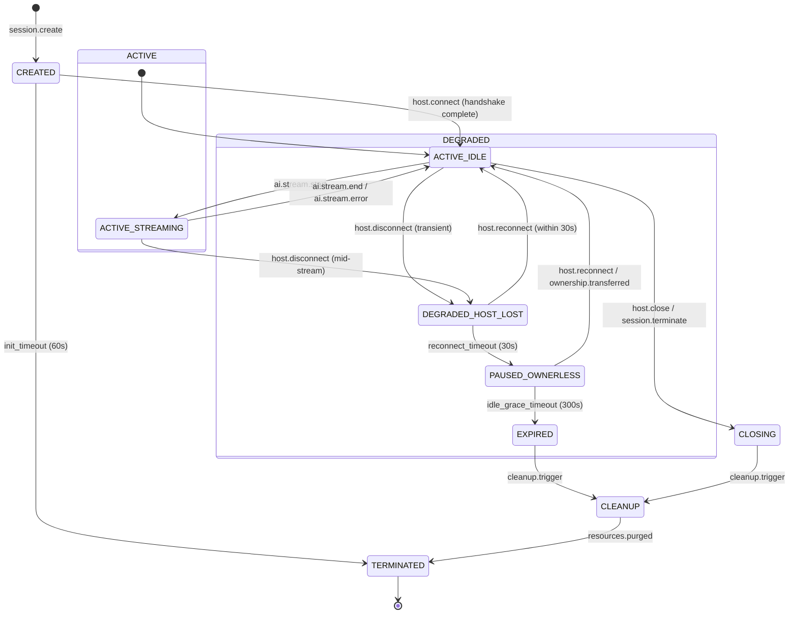
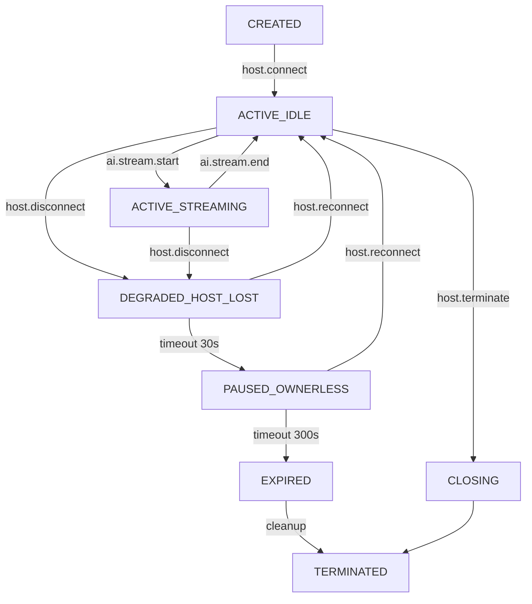
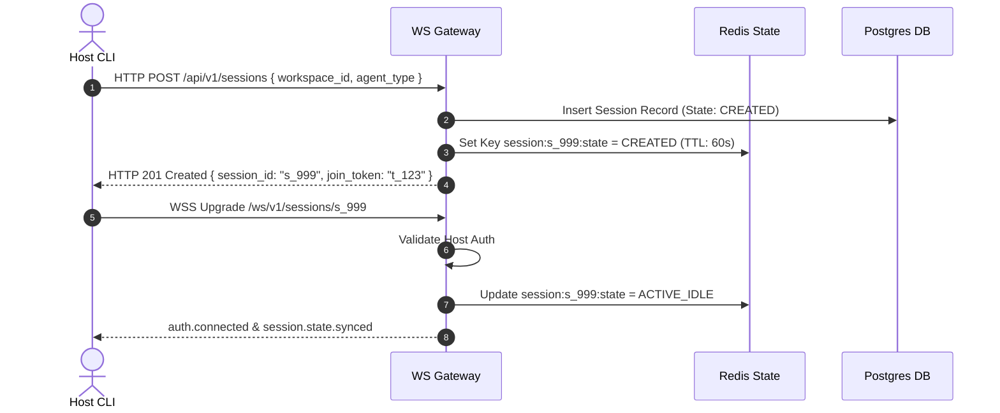
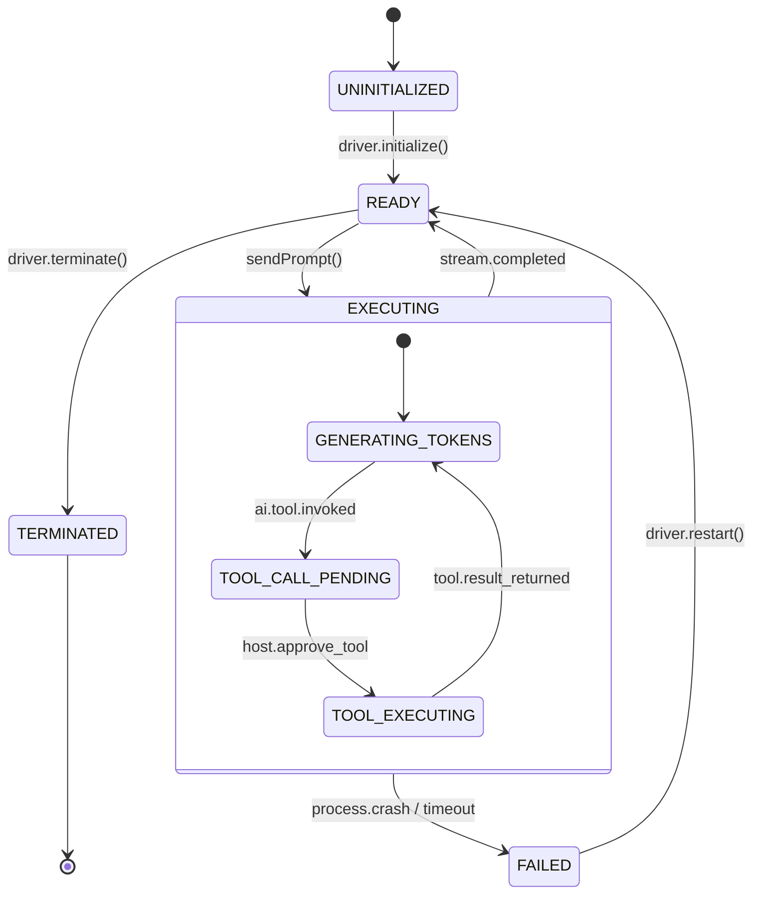
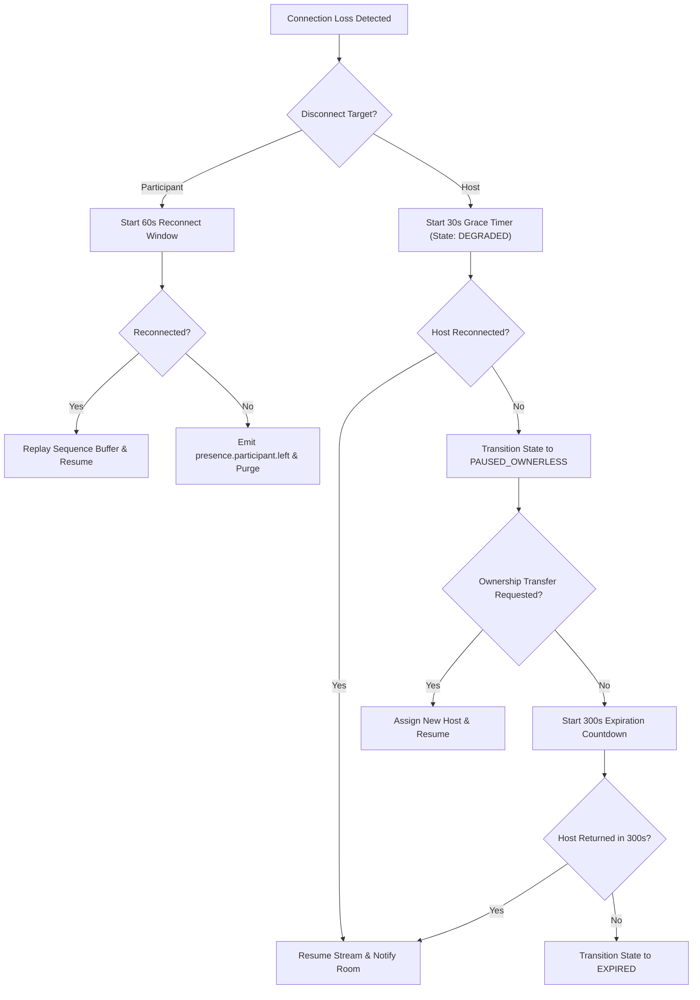
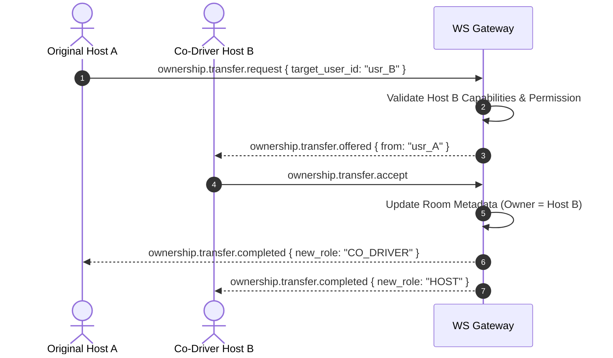
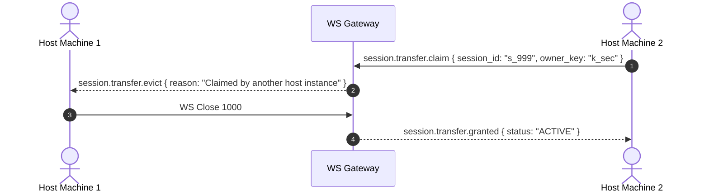
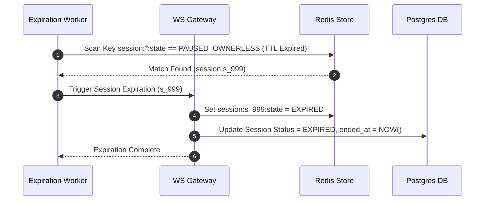
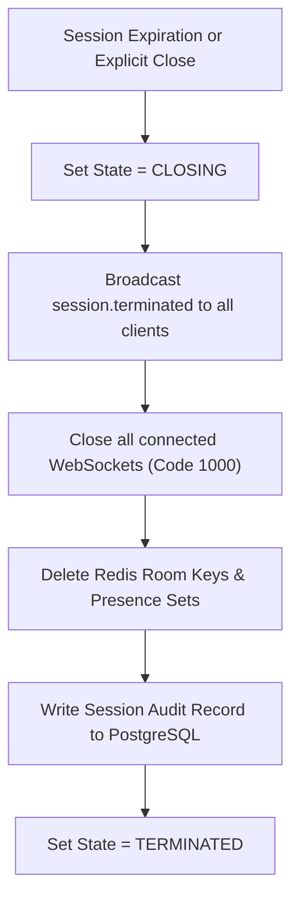

# RFC-0004: Session Lifecycle & Distributed State Machine Specification

**Title:** Collagility Session Lifecycle Specification (v1.0.0-draft)  
**Author:** Staff Software Architect  
**Status:** Draft / Proposal  
**Created:** July 2026  
**Target Systems:** `@collagility/server`, `@collagility/cli`, Relay Infrastructure  

---

## 1. Executive Summary

This document specifies the authoritative distributed state machine and complete lifecycle management model for collaborative sessions in **Collagility**.

A Collagility session represents an active, synchronized multiplayer workspace where multiple developers interact with a local AI coding agent running on the session owner's machine. Because Collagility enforces a local-first, zero-trust architecture, session state is distributed across the local host CLI, stateless relay server nodes (`SessionStore` / `SessionManager`), and remote participant clients.

This specification defines all formal session states **(done)**, state transitions **(done)**, heartbeat mechanics **(done)**, disconnect/reconnect recovery policies **(done)**, local AI execution lifecycles **(done)**, ownership transfers **(done)**, edge case handling **(done)**, and cleanup protocols **(done)** required to ensure fault tolerance in unreliable network environments. Persistent database archival is reserved for future enterprise milestones **(future)**.

---

## 2. Session Lifecycle Overview

The session lifecycle spans six distinct macro-phases:

```
[Phase 1: Creation & Init] ──> [Phase 2: Active Multiplayer] ──> [Phase 3: Degraded / Recovery]
                                          │                                │
                                          ▼                                ▼
[Phase 6: Termination]     <── [Phase 5: Cleanup & Archival] <── [Phase 4: Expiration]
```

1. **Creation & Initialization:** Session record created, host authenticates, local AI driver process initializes, and room tokens are issued.
2. **Active Multiplayer:** Host and participants stream AI events, submit co-prompts, engage in side-chat, and synchronize presence state.
3. **Degraded / Recovery:** Transient network losses, host/participant disconnects, or local AI process crashes. Graceful timers allow reconnection and stream replay without session destruction.
4. **Expiration:** Inactive or abandoned rooms transition to expired state after strict grace period timeouts.
5. **Cleanup & Archival:** Redis room buffers and socket subscriptions are purged; audit metadata is persisted.
6. **Final Termination:** Session enters immutable terminal state; resources are fully released.

---

## 3. Session State Machine

### 3.1 Complete Session State Machine Diagram



---

## 4. Session States

| State Name | Category | Description | Allowed Inputs | Exit Triggers |
| :--- | :--- | :--- | :--- | :--- |
| `CREATED` | Transient | Room record initialized in DB/Redis; waiting for Host WebSocket. | `host.connect` | Host connects or 60s timeout. |
| `ACTIVE_IDLE` | Operational | Host and 0+ participants connected. AI agent idle. | `ai.stream.start`, `participant.join`, `host.disconnect` | Prompt execution or Host disconnect. |
| `ACTIVE_STREAMING` | Operational | Host's local AI process is actively streaming response tokens. | `ai.stream.chunk`, `ai.stream.end`, `host.disconnect` | Stream completion, error, or Host disconnect. |
| `DEGRADED_HOST_LOST` | Recovery | Host WebSocket dropped; 30s grace window active for Host reconnect. | `host.reconnect` | Host reconnects or 30s timer expires. |
| `PAUSED_OWNERLESS` | Recovery | Host failed to reconnect in 30s; session paused for participants. | `host.reconnect`, `ownership.transfer` | Host returns, transfer succeeds, or 300s timeout. |
| `EXPIRED` | Pre-Cleanup | Session timed out without Host recovery; read-only freeze. | `session.archive` | Automated background cleanup job. |
| `CLOSING` | Termination | Explicit shutdown sequence in progress; notifying clients. | `socket.close` | Sockets closed; flush complete. |
| `CLEANUP` | Internal | Purging Redis keys, closing channels, writing audit log. | `system.purge` | Memory cleared. |
| `TERMINATED` | Terminal | Immutable end state. Session ID retired. | None | N/A |

---

## 5. State Transition Rules



---

## 6. Session Creation Flow



---

## 7. User Join Flow

```mermaid
sequenceDiagram
    autonumber
    actor Participant as Participant Client
    participant Server as WS Gateway
    participant Redis as Redis State
    actor Host as Host CLI

    Participant->>Server: WSS Upgrade /ws/v1/sessions/s_999 (Join Token)
    Server->>Redis: Get Session State & Validate Token
    alt State == ACTIVE_IDLE or ACTIVE_STREAMING
        Server->>Redis: SADD session:s_999:participants "usr_part1"
        Server-->>Participant: session.joined { role: "CO_DRIVER", last_seq: 1040 }
        Server-->>Host: presence.participant.joined { user_id: "usr_part1" }
    else State == PAUSED_OWNERLESS or EXPIRED
        Server-->>Participant: error.session_unavailable { code: 4004 }
    end
```

---

## 8. User Leave Flow

```mermaid
sequenceDiagram
    autonumber
    actor Participant as Participant Client
    participant Server as WS Gateway
    participant Redis as Redis State
    actor Host as Host CLI

    Participant->>Server: session.leave { session_id: "s_999" }
    Server->>Redis: SREM session:s_999:participants "usr_part1"
    Server-->>Participant: session.left { status: "SUCCESS" }
    Server-->>Host: presence.participant.left { user_id: "usr_part1" }
    Server->>Participant: WS Close 1000 (Normal Closure)
```

---

## 9. Owner Disconnect Flow

```mermaid
sequenceDiagram
    autonumber
    actor Host as Host CLI
    participant Server as WS Gateway
    participant Redis as Redis State
    actor Participant as Participant Client

    Note over Host,Server: Host Connection Drops (Network Failure)
    Server->>Server: Detect Socket Drop / Ping Timeout
    Server->>Redis: Set session:s_999:state = DEGRADED_HOST_LOST
    Server->>Redis: Set Key session:s_999:host_timer = 30s
    Server-->>Participant: session.degraded { reason: "HOST_DISCONNECTED", grace_sec: 30 }

    alt Host Reconnects within 30s
        Note over Host,Server: See Reconnect Flow
    else 30s Grace Timer Expires
        Server->>Redis: Set session:s_999:state = PAUSED_OWNERLESS
        Server-->>Participant: session.paused { reason: "OWNER_RECONNECT_TIMEOUT" }
    end
```

---

## 10. Participant Disconnect Flow

```mermaid
sequenceDiagram
    autonumber
    actor Participant as Participant Client
    participant Server as WS Gateway
    participant Redis as Redis State
    actor Host as Host CLI

    Note over Participant,Server: Participant Socket Drops
    Server->>Server: Detect Missing Heartbeat (45s)
    Server->>Redis: Set user:usr_part1:status = DISCONNECTED
    Server-->>Host: presence.participant.disconnected { user_id: "usr_part1", grace_sec: 60 }
    
    note over Server: If participant does not reconnect in 60s, emit participant.left
```

---

## 11. Reconnect Flow

```mermaid
sequenceDiagram
    autonumber
    actor Host as Host CLI
    participant Server as WS Gateway
    participant Redis as Redis State
    actor Participant as Participant Client

    Host->>Server: WSS Reconnect /ws/v1/sessions/s_999 { last_seq: 1042 }
    Server->>Redis: Verify Host Role & Session State
    Server->>Redis: Set session:s_999:state = ACTIVE_IDLE
    Server-->>Host: auth.reconnected { missed_events: [1043, 1044] }
    Server-->>Participant: session.resumed { status: "ACTIVE" }
```

---

## 12. AI Lifecycle

### 12.1 AI Lifecycle State Machine



---

## 13. AI Failure Recovery

```mermaid
sequenceDiagram
    autonumber
    actor HostAI as Local Gemini CLI
    actor HostCLI as Host CLI Driver
    participant Server as WS Gateway
    actor Participant as Participant Client

    HostAI->>HostCLI: Process Crash (Exit Code 139 / SIGSEGV)
    HostCLI->>HostCLI: Capture stderr output
    HostCLI->>Server: ai.execution.failed { error: "Segmentation fault", can_restart: true }
    Server-->>Participant: ai.execution.failed { error: "Local AI process crashed" }
    
    HostCLI->>HostAI: Respawn Process (gemini --restart)
    HostAI-->>HostCLI: Process Ready
    HostCLI->>Server: ai.driver.ready { agent_type: "GEMINI_CLI" }
    Server-->>Participant: ai.driver.ready
```

---

## 14. Session Recovery Strategy



---

## 15. Ownership Transfer



---

## 16. Session Transfer

Session transfer occurs when a host transfers execution from machine A to machine B (e.g. desktop to laptop) while retaining ownership credentials.



---

## 17. Session Expiration



---

## 18. Cleanup Strategy



---

## 19. Failure Handling & Edge Cases

### 19.1 Detailed Edge Case Matrix

| Edge Case Scenario | Trigger Condition | System Behavior & Mitigation |
| :--- | :--- | :--- |
| **Last Participant Leaves** | All remote participants disconnect; Host remains. | Session remains `ACTIVE_IDLE`. Host can continue local AI pairing or await new joiners. |
| **Owner Disconnects Mid-AI Stream** | Host WebSocket drops while AI is emitting tokens. | Server buffers last token `seq`, pauses stream, notifies room (`session.degraded`), starts 30s host reconnect timer. |
| **AI Crashes During Streaming** | Local AI subprocess returns fatal error or segfault. | Host CLI captures `stderr`, transmits `ai.execution.failed` frame, and attempts local process respawn. |
| **Reconnect After Expiration** | Client attempts `auth.reconnect` on an `EXPIRED` session. | Server rejects connection with `error.session_expired` (Code 4010). Client UI prompts user to start a new session. |
| **Duplicate Reconnects** | Network split causes two host sockets with identical credentials. | Server evicts oldest socket connection (`session.evicted`), keeping only the newest authenticated socket. |
| **Simultaneous Transfer Requests** | Two users request ownership transfer concurrently. | Server uses Redis distributed lock (`SETNX lock:session:s_999`). First claim succeeds; second fails with 409 Conflict. |
| **Heartbeat Loss (Zombie Sockets)** | TCP socket silent drop without RST packet. | Server heartbeat monitor drops socket after 3 consecutive missed PING responses (45 seconds). |
| **Server Node Crash Mid-Session** | Relay server container instance is killed. | Clients auto-reconnect to another Fastify node via NLB. Redis Pub/Sub restores room broadcast state instantly. |

---

## 20. Operational & Scalability Considerations

1. **Stateless Node Reconnects:** Fastify nodes hold no session state in memory; any node can handle reconnect requests for any room by querying Redis.
2. **Key Expiration Timers:** Redis TTL keys drive `DEGRADED` and `PAUSED` timeouts automatically, preventing zombie room accumulation.

---

## 21. Security Considerations

1. **Host Isolation:** Remote participant actions in `PAUSED_OWNERLESS` or `DEGRADED` states are strictly rejected.
2. **Replay Buffer Protection:** Event replay buffers scrub sensitive environment headers before storing frames.

---

## 22. Future Extensions

* **Persistent Session Archival:** Uploading deterministic session replay logs to S3 for offline playback.
* **Distributed Multi-Host Pairing:** Allowing multiple hosts to connect different local AI agents into a single unified room.

---
