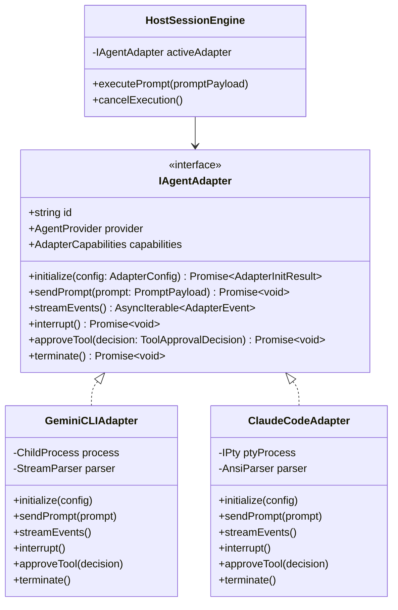
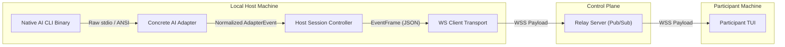
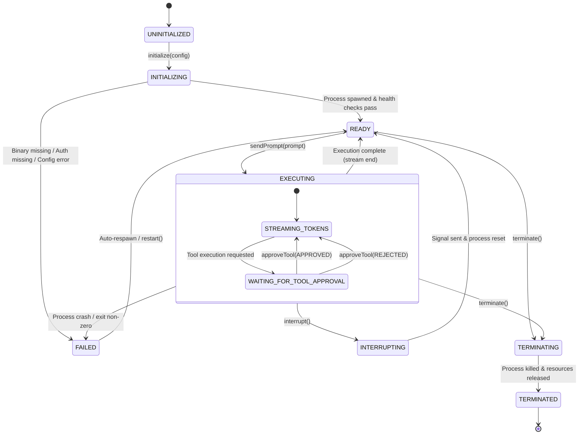
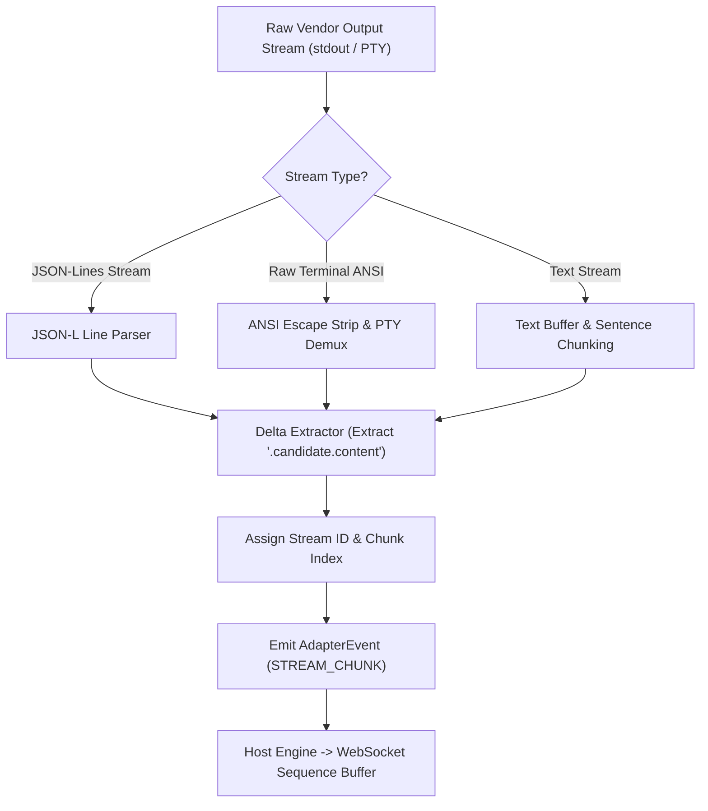
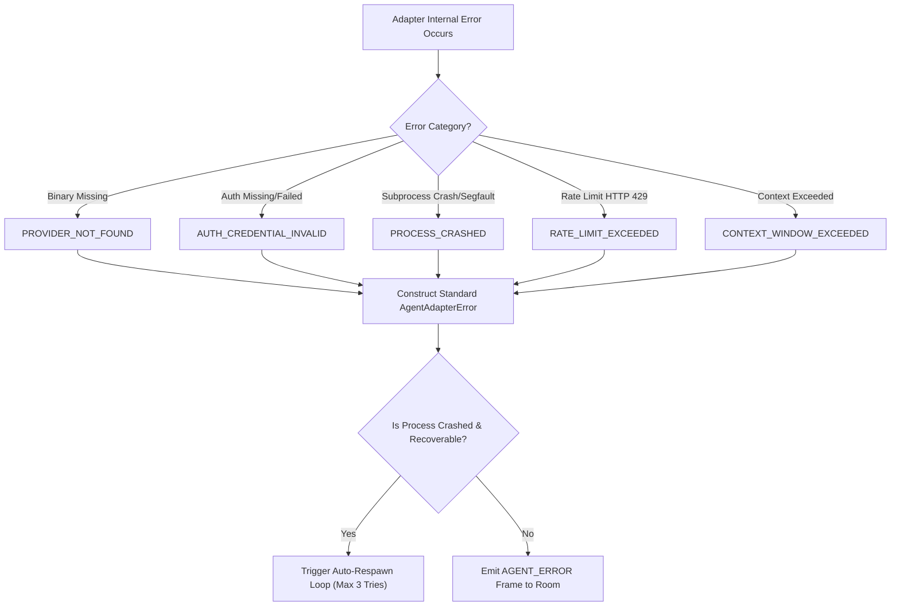
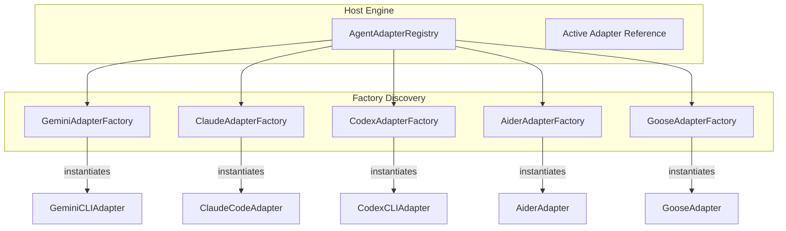
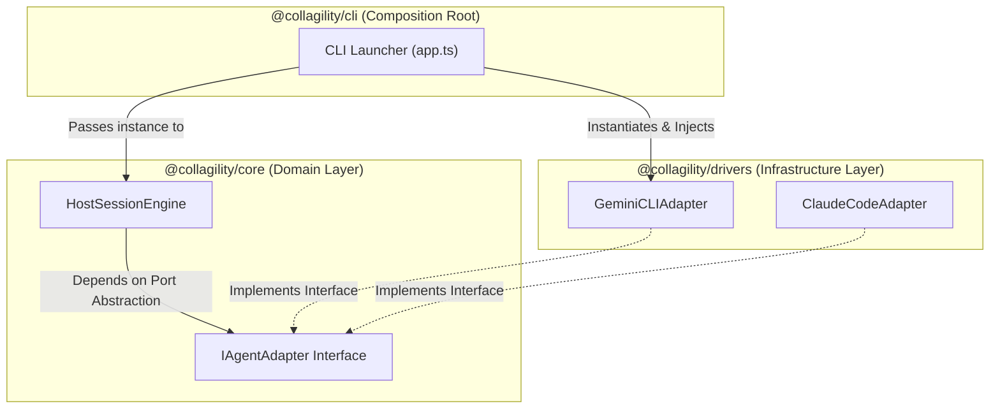

# RFC-0005: AI Adapter Architecture Specification

**Title:** Collagility — Local AI Adapter Architecture & Hexagonal Integration Specification  
**Author:** Staff Software Architect  
**Status:** Draft / Proposal  
**Created:** July 2026  
**Target Packages:** `@collagility/cli`, `@collagility/core`, `@collagility/drivers`  

---

## 1. Executive Summary

This document specifies the formal **AI Adapter Architecture** for **Collagility**, the open-source multiplayer workspace for local AI coding agents.

Collagility enables real-time collaboration across local AI coding sessions (such as **Gemini CLI** initially, and **Claude Code**, **OpenAI Codex CLI**, **Aider**, and **Goose** in future iterations). To achieve zero-trust security and complete code privacy, Collagility mandates a strict boundary constraint: **the central relay server must never know about AI, LLM vendor APIs, or prompt contexts.** All AI process execution, credential management, local file system interactions, prompt execution, and response token parsing occur exclusively on the session host's local machine via the `@collagility/cli` client.

This specification details how the Hexagonal Adapter Pattern decouples Collagility's core collaboration domain from heterogeneous local AI binaries, CLI interfaces, stdio streams, PTY pseudo-terminals, and IPC protocols.

---

## 2. Core Architectural Requirement & Constraints

1. **Zero-Knowledge Backend Isolation:** The relay server acts purely as a high-throughput pub/sub event router. It is strictly agnostic to AI providers, LLM token schemas, prompt payloads, and vendor credentials. Server nodes route generic, self-describing protocol event frames (e.g., `ai.stream.chunk`, `ai.request.prompt_suggested`) without inspecting, transforming, or storing AI context.
2. **Local AI Execution Locality:** Local AI binaries (e.g., `gemini`, `claude`, `codex`, `aider`, `goose`) run as child processes or PTY sessions strictly on the Host machine, utilizing local API keys, OAuth tokens, and local file context.
3. **Hexagonal Provider Neutrality:** The host CLI domain core depends solely on the abstract `IAgentAdapter` interface port. Adding support for a new AI CLI binary requires writing an adapter without modifying core session controllers or server components.
4. **Resilient Multiprocess Interactivity:** Adapters must handle asynchronous stdio buffering, token delta extraction, interactive tool approval hooks, process crashes, and immediate cancellation interrupts (`SIGINT`).

---

## 3. Architecture Overview

```mermaid
graph TD
    subgraph Remote Participants ["Participant Machines (Remote Clients)"]
        ParticipantCLI["Participant CLI / Ink TUI"]
    end

    subgraph Relay Server ["Collagility Control Plane (Zero-Knowledge Relay)"]
        WSGateway["Fastify WS Gateway & Router"]
        NoteServer["Zero AI Logic / No AI Keys"]
    end

    subgraph Host Machine ["Host Machine (Local Environment)"]
        HostEngine["Host Session Controller (@collagility/cli)"]
        
        subgraph Port Boundary ["Core Interface Port"]
            IAgentAdapter["IAgentAdapter (Domain Port)"]
        end

        subgraph Concrete Drivers ["Adapter Drivers (@collagility/drivers)"]
            GeminiAdapter["GeminiCLIAdapter (Initial)"]
            ClaudeAdapter["ClaudeCodeAdapter (Future)"]
            CodexAdapter["CodexCLIAdapter (Future)"]
            AiderAdapter["AiderAdapter (Future)"]
            GooseAdapter["GooseAdapter (Future)"]
        end

        subgraph Local System Processes ["Native OS Subprocesses"]
            GeminiProcess["gemini (CLI Process)"]
            ClaudeProcess["claude (PTY / Subprocess)"]
            CodexProcess["codex (CLI Process)"]
            AiderProcess["aider (Python Subprocess)"]
            GooseProcess["goose (Rust / CLI Process)"]
        end

        HostEngine --> IAgentAdapter
        IAgentAdapter <|.. GeminiAdapter
        IAgentAdapter <|.. ClaudeAdapter
        IAgentAdapter <|.. CodexAdapter
        IAgentAdapter <|.. AiderAdapter
        IAgentAdapter <|.. GooseAdapter

        GeminiAdapter <-->|"stdio / stdout stream"| GeminiProcess
        ClaudeAdapter <-->|"PTY / stdio stream"| ClaudeProcess
        CodexAdapter <-->|"IPC / stdio stream"| CodexProcess
        AiderAdapter <-->|"stdio / JSON stream"| AiderProcess
        GooseAdapter <-->|"stdio / API socket"| GooseProcess
    end

    ParticipantCLI <-->|"WSS Event Frames"| WSGateway
    WSGateway <-->|"WSS Event Frames"| HostEngine

    style NoteServer fill:#ff9,stroke:#333,stroke-width:1px
    style IAgentAdapter fill:#bbf,stroke:#333,stroke-width:2px
    style HostEngine fill:#dfd,stroke:#333,stroke-width:2px
```

---

## 4. Section 1: Adapter Pattern Design

The AI Adapter Architecture applies the **GoF Adapter Pattern** within a **Hexagonal Architecture** (Ports & Adapters) framework.

### 4.1 Structural Pattern Anatomy
* **Target Interface (Port):** `IAgentAdapter` — The canonical domain interface consumed by the `HostSessionEngine`. Defines standard methods for process lifecycle, prompt submission, token stream consumption, tool execution approvals, and interrupt signaling.
* **Adaptee (Native Tool Interface):** Provider-specific executables (`gemini`, `claude`, `codex`, `aider`, `goose`). Each tool exhibits distinct communication mechanisms:
  * **Gemini CLI:** Standard I/O text streams with structured JSON emission flags (`--output=json-stream`) or text stdio piping.
  * **Claude Code:** Interactive PTY (Pseudo-Terminal) terminal stream parsing ansi escape sequences or structured `--json` mode.
  * **Codex CLI / Aider / Goose:** Varying line-buffered stdio, IPC sockets, or local HTTP control loops.
* **Concrete Adapter:** Classes implementing `IAgentAdapter` (e.g., `GeminiCLIAdapter`, `ClaudeCodeAdapter`). The concrete adapter encapsulates process spawning, input formatting, stdio stream parsing, delta generation, and signal forwarding.



---

## 5. Section 2: Component Responsibilities

To enforce strict separation of concerns, responsibilities across the Collagility ecosystem are demarcated as follows:



| Component | Layer / Scope | Primary Responsibility | Explicit Non-Responsibility |
| :--- | :--- | :--- | :--- |
| **Native AI Binary** (`gemini`, `claude`, etc.) | Host OS Subprocess | Generates LLM completions, invokes local tools, reads local files using local API keys. | Has no knowledge of Collagility, WebSockets, or remote participants. |
| **Concrete AI Adapter** (`GeminiCLIAdapter`) | `@collagility/drivers` | Spawns and manages native process stdio/PTY; translates provider stdio output into normalized domain events; formats input prompts. | Does NOT perform WebSocket networking or manage session participant permissions. |
| **Host Session Controller** (`HostSessionEngine`) | `@collagility/cli` | Orchestrates adapter lifecycle; receives prompt suggestions from participants; handles host manual approval; serializes events to WebSocket frames. | Does NOT format LLM prompts directly or parse raw CLI vendor stdout. |
| **Relay Server Node** | `@collagility/server` | Validates JWT room tokens; enforces role permissions; fans out WebSocket event frames to room sockets via Redis Pub/Sub. | **STRICTLY PROHIBITED** from inspecting prompt content, parsing AI streams, or connecting to LLM vendor APIs. |
| **Participant CLI TUI** | `@collagility/cli` | Renders stream chunks in Ink TUI; transmits co-prompt suggestions and out-of-band chat to host. | Does NOT run local LLM processes or possess LLM API keys. |

---

## 6. Section 3: Adapter Lifecycle & State Machine

Every AI Adapter transitions through a deterministic finite state machine (FSM) managed by the host CLI engine.

### 6.1 Lifecycle State Machine Diagram



### 6.2 Lifecycle Phases & Mechanics

1. **Initialization (`UNINITIALIZED` $\rightarrow$ `INITIALIZING` $\rightarrow$ `READY`):**
   * Verifies local binary presence in host PATH (e.g., `which gemini`).
   * Validates local credential availability (e.g., `GEMINI_API_KEY` or `gcloud` auth context).
   * Spawns child process with configured flags (e.g., stream mode, tool auto-execution policies).
   * Attaches `stdout`, `stderr`, and `stdin` stream listeners.
2. **Execution (`READY` $\rightarrow$ `EXECUTING`):**
   * Receives prompt payload from `HostSessionEngine`.
   * Formats prompt with file context attachments into provider-native format.
   * Injects input into binary's `stdin` or CLI invocation channel.
3. **Streaming & Interactivity (`STREAMING_TOKENS` $\leftrightarrow$ `WAITING_FOR_TOOL_APPROVAL`):**
   * Emits `stream_chunk` events incrementally as stdout deltas arrive.
   * If the tool requests execution (e.g., modifying a file, running bash command), adapter emits `tool_approval_requested` and pauses execution state.
4. **Interruption & Teardown (`INTERRUPTING` / `TERMINATING`):**
   * Sends `SIGINT` (Ctrl+C) or vendor-specific cancellation commands to native process.
   * Gracefully drains buffers, releases file handles, and transitions back to `READY` or `TERMINATED`.

---

## 7. Section 4: Prompt Flow Architecture

The prompt flow coordinates remote participant suggestions, host approval, adapter formatting, and native binary injection.

```mermaid
sequenceDiagram
    autonumber
    actor Participant as Co-Driver (Participant)
    participant Relay as Relay Server
    actor Host as Host CLI (Session Owner)
    participant Engine as Host Session Engine
    participant Adapter as GeminiCLIAdapter
    participant NativeAI as Native Gemini CLI

    Participant->>Relay: WS Frame: ai.request.suggest_prompt { prompt: "Refactor to async/await" }
    Relay->>Relay: Verify Sender Role == CO_DRIVER
    Relay-->>Host: WS Broadcast: ai.request.prompt_suggested { suggestion_id: "sug_101", prompt: "..." }
    
    Host->>Engine: User selects "Approve & Run" in Ink TUI
    Engine->>Engine: Assign Correlation ID & Transition State to EXECUTING
    Engine->>Relay: WS Frame: ai.execution.started { prompt_id: "req_202", correlation_id: "corr_99" }
    Relay-->>Participant: WS Broadcast: ai.execution.started
    
    Engine->>Adapter: sendPrompt({ text: "Refactor to async/await", contextFiles: [...] })
    Adapter->>Adapter: Format Vendor Input Payload (e.g. JSON-RPC or Stdin stream)
    Adapter->>NativeAI: Write to Stdin / Send IPC Frame
    
    loop Stream Response
        NativeAI-->>Adapter: Raw Stdout Chunks / Token Events
        Adapter->>Adapter: Parse Delta Text & Normalize to AdapterEvent
        Adapter-->>Engine: emit("event", { type: "STREAM_CHUNK", delta: "async function..." })
        Engine->>Relay: WS Frame: ai.stream.chunk { stream_id: "st_55", delta: "async function..." }
        Relay-->>Participant: WS Broadcast: ai.stream.chunk
    end

    NativeAI-->>Adapter: Stream End / Process Flush
    Adapter-->>Engine: emit("event", { type: "STREAM_END", tokensUsed: 350 })
    Engine->>Relay: WS Frame: ai.stream.end { stream_id: "st_55" }
    Relay-->>Participant: WS Broadcast: ai.stream.end
```

---

## 8. Section 5: Streaming Flow & Delta Extraction

Because CLI tools emit output in varying formats (raw UTF-8 text, ANSI terminal escape sequences, structured SSE lines, or JSON-L streams), the adapter layer standardizes all output into unified delta events.



### 8.1 Streaming Flow Mechanics
1. **Delta Normalization:** The adapter extracts incremental text string deltas instead of re-broadcasting cumulative output buffers, minimizing WebSocket bandwidth.
2. **Reasoning & Tool Stream Splitting:** Standard text tokens are marked `reasoning: false`. Reasoning/thinking tokens (e.g., Gemini 2.5/3 thinking output) are tagged with `reasoning: true` to allow TUIs to render thoughts in collapsible accordion UI components.
3. **Monotonic Chunk Indexing:** Each stream delta contains a zero-indexed `chunk_index` scoped to the `stream_id`, ensuring clients detect missing chunks over dropped frames.

---

## 9. Section 6: Standardized Error Handling Strategy

AI Adapters encapsulate process crashes, missing credentials, API rate limits, and context window overflows into standard domain errors.



### 9.1 Error Taxonomy

| Error Code | Trigger Cause | Adapter Recovery Action | Session Impact |
| :--- | :--- | :--- | :--- |
| `PROVIDER_NOT_FOUND` | AI CLI executable not installed or missing from PATH. | Rejects initialization; prompts host to install binary. | Session fails startup gracefully. |
| `AUTH_CREDENTIAL_INVALID` | Vendor API key missing or expired OAuth token. | Emits auth error; prompts host CLI to run authentication. | Pauses prompt execution. |
| `PROCESS_CRASHED` | Native binary segfault, unhandled exception, or SIGKILL. | Respawns native process (up to 3 retries); preserves history. | Stream fails with error chunk; process recovers. |
| `RATE_LIMIT_EXCEEDED` | LLM vendor API HTTP 429 rate limit exceeded. | Implements exponential backoff; notifies host of retry wait. | Pauses stream temporarily. |
| `CONTEXT_WINDOW_EXCEEDED`| Prompt + file context exceeds model token limit. | Emits context error; suggests context truncation in TUI. | Prompts host to trim workspace files. |
| `TOOL_EXECUTION_FAILED` | Tool command execution failed on local system. | Captures tool stderr; passes error back to LLM context loop. | LLM attempts corrective action. |

---

## 10. Section 7: Interruption & Cancellation Architecture

When a host or authorized co-driver cancels an in-flight prompt execution, the interrupt signal must propagate instantly down to the OS child process.

```mermaid
sequenceDiagram
    autonumber
    actor Host as Host User (TUI)
    participant Engine as Host Session Engine
    participant Adapter as GeminiCLIAdapter
    participant NativeAI as Native Gemini Subprocess
    participant Relay as Relay Server
    actor Participant as Participant Client

    Host->>Engine: Press Ctrl+C / Click "Interrupt"
    Engine->>Engine: Flag Session State = INTERRUPTING
    Engine->>Relay: WS Frame: ai.stream.interrupted { stream_id: "st_55", reason: "USER_CANCELLED" }
    Relay-->>Participant: WS Broadcast: ai.stream.interrupted
    
    Engine->>Adapter: interrupt()
    
    alt Standard Process Stdio Signal
        Adapter->>NativeAI: Send SIGINT / SIGTERM signal
    else PTY Session (Claude Code)
        Adapter->>NativeAI: Write '\x03' (Ctrl+C character byte) to PTY
    else IPC Control Channel (Codex / Goose)
        Adapter->>NativeAI: Send JSON-RPC {"method": "cancel"} frame
    end

    NativeAI-->>Adapter: Subprocess stops generation & emits exit/cancellation acknowledgement
    Adapter->>Adapter: Flush stdio buffers & reset internal stream state
    Adapter-->>Engine: Promise resolved (Adapter state reset to READY)
    Engine->>Engine: Transition State to READY
```

---

## 11. Section 8: Multiple AI Support & Adapter Registry

Collagility supports selecting, hot-swapping, and orchestrating multiple AI providers through an extensible `AgentAdapterRegistry`.



### 8.1 Multi-Provider Capability Matrix

| Provider | Driver Strategy | Communication Channel | Tool Execution Model | Multi-Turn Context |
| :--- | :--- | :--- | :--- | :--- |
| **Gemini CLI** (Initial) | Process Subprocess | Stdio / JSON-L Stream | Auto / Manual Approval Hooks | Managed via Native CLI Session State |
| **Claude Code** (Future) | PTY Pseudo-Terminal | Term ANSI / PTY Pipe | System Tool Intercept Hooks | Managed via Local Claude File Logs |
| **Codex CLI** (Future) | Process Subprocess | Stdio / JSON RPC | CLI Approval Callbacks | Managed via Session State File |
| **Aider** (Future) | Subprocess Driver | Stdio / Python Pipe | Git Commit Auto-Hooks | Managed via Git Branch History |
| **Goose** (Future) | IPC / API Driver | Local HTTP / IPC Socket | Goose Extension Toolkit | Managed via Local DB Session Store |

---

## 12. Section 9: Future Plugin Architecture

To allow community developers to create third-party AI adapters (e.g., for internal proprietary CLI agents), Collagility exposes a dynamic Plugin SDK (`@collagility/plugin-sdk`).

```
collagility-plugin-custom-ai/
├── package.json               # Package manifest declaring plugin entrypoint
├── plugin.json                # Collagility metadata (provider key, binary requirements)
└── dist/
    └── index.js               # Exports class implementing IAgentAdapter & AdapterFactory
```

```mermaid
graph TD
    subgraph CLI Core
        PluginLoader["Dynamic Plugin Loader"]
        Registry["Adapter Registry"]
    end

    subgraph External Plugins
        BuiltIn["@collagility/drivers (Built-in)"]
        PluginA["collagility-plugin-ollama (Community)"]
        PluginB["collagility-plugin-custom-agent (Enterprise)"]
    end

    PluginLoader -->|"1. Scans node_modules & ~/.collagility/plugins"| ExternalPlugins
    PluginLoader -->|"2. Validates Manifest & Security Sandbox"| Registry
    Registry -->|"3. Registers Adapter Factories"| CLI Core
```

### 9.1 Plugin Security & Isolation Guarantees
* **Local Sandbox Boundary:** Plugins execute exclusively on the host CLI. They have zero server-side components.
* **Manifest Validation:** Plugins declare required CLI binaries and minimum protocol versions in `plugin.json`.
* **Zero Remote Secret Transmission:** Plugins must conform to `IAgentAdapter` and are strictly barred from transmitting API keys to external non-vendor endpoints.

---

## 13. Section 10: Complete TypeScript Interface Specification

Below is the complete, production-grade TypeScript interface specification governing the AI Adapter domain.

```typescript
/**
 * Supported AI Provider Identifiers
 */
export type AgentProviderType = 
  | 'gemini' 
  | 'claude' 
  | 'codex' 
  | 'aider' 
  | 'goose' 
  | string;

/**
 * Adapter Health & Status Types
 */
export type AdapterStatus = 
  | 'UNINITIALIZED'
  | 'INITIALIZING'
  | 'READY'
  | 'EXECUTING'
  | 'WAITING_FOR_TOOL_APPROVAL'
  | 'INTERRUPTING'
  | 'FAILED'
  | 'TERMINATED';

/**
 * Declared Capabilities of a specific AI Adapter
 */
export interface AdapterCapabilities {
  supportsReasoningStream: boolean;
  supportsToolApprovals: boolean;
  supportsContextFiles: boolean;
  supportsCustomSystemPrompt: boolean;
  supportsMultimodal: boolean;
  supportedInputTypes: Array<'text' | 'image' | 'diff'>;
}

/**
 * Configuration supplied when initializing an AI Adapter instance
 */
export interface AdapterConfig {
  workspacePath: string;
  binaryPath?: string;
  customArgs?: string[];
  environment?: Record<string, string>;
  systemPromptOverlay?: string;
  autoApproveTools?: boolean;
}

/**
 * Standard Prompt Payload passed from Host Engine to Adapter
 */
export interface PromptPayload {
  promptId: string;
  correlationId: string;
  text: string;
  contextFiles?: Array<{
    filePath: string;
    content?: string;
    lineRange?: [number, number];
  }>;
  metadata?: Record<string, unknown>;
}

/**
 * Adapter Stream Event Types
 */
export type AdapterEventType = 
  | 'STREAM_START'
  | 'STREAM_CHUNK'
  | 'REASONING_CHUNK'
  | 'TOOL_APPROVAL_REQUESTED'
  | 'TOOL_EXECUTED'
  | 'STREAM_END'
  | 'ERROR';

/**
 * Event emitted by IAgentAdapter during stream execution
 */
export interface AdapterEvent {
  id: string;
  promptId: string;
  correlationId: string;
  type: AdapterEventType;
  timestamp: number;
  payload: {
    streamId?: string;
    chunkIndex?: number;
    delta?: string;
    reasoning?: string;
    toolCall?: {
      toolId: string;
      toolName: string;
      arguments: Record<string, unknown>;
    };
    tokensUsed?: {
      promptTokens: number;
      completionTokens: number;
      totalTokens: number;
    };
    error?: {
      code: string;
      message: string;
      details?: unknown;
    };
  };
}

/**
 * Decision returned by Host for a pending Tool Approval
 */
export interface ToolApprovalDecision {
  toolId: string;
  approved: boolean;
  userFeedback?: string;
}

/**
 * Health check diagnostics for an Adapter
 */
export interface AdapterHealthStatus {
  status: AdapterStatus;
  provider: AgentProviderType;
  binaryPath: string;
  binaryVersion?: string;
  isProcessAlive: boolean;
  lastError?: string;
}

/**
 * Primary Hexagonal Port Interface for AI Adapters
 */
export interface IAgentAdapter {
  readonly id: string;
  readonly name: string;
  readonly provider: AgentProviderType;
  readonly status: AdapterStatus;
  readonly capabilities: AdapterCapabilities;

  /**
   * Initializes native subprocess / PTY connection and validates environment
   */
  initialize(config: AdapterConfig): Promise<void>;

  /**
   * Dispatches a user prompt to the native AI agent
   */
  sendPrompt(prompt: PromptPayload): Promise<void>;

  /**
   * Async iterator yielding normalized stream events emitted by the AI process
   */
  streamEvents(): AsyncIterable<AdapterEvent>;

  /**
   * Immediately interrupts active prompt generation (SIGINT / Ctrl+C)
   */
  interrupt(): Promise<void>;

  /**
   * Submits a host approval/rejection decision for a pending tool execution
   */
  approveTool(decision: ToolApprovalDecision): Promise<void>;

  /**
   * Checks runtime health and binary readiness
   */
  getHealth(): Promise<AdapterHealthStatus>;

  /**
   * Gracefully terminates native subprocess and releases resources
   */
  terminate(): Promise<void>;
}
```

---

## 14. Section 11: Dependency Inversion Principle (DIP)

The AI Adapter Architecture strictly adheres to the **Dependency Inversion Principle (SOLID)**:

1. **High-level modules (`HostSessionEngine`, `CLI Application`) do not depend on low-level modules (`GeminiCLIAdapter`, `ClaudeCodeAdapter`, `ChildProcess`). Both depend on abstractions (`IAgentAdapter`).**
2. **Abstractions do not depend on details. Details (`GeminiCLIAdapter`) depend on abstractions (`IAgentAdapter`).**



By decoupling concrete driver dependencies using a **Composition Root** pattern in `@collagility/cli`, the core domain logic can be unit-tested using mock adapter implementations (`MockAgentAdapter`) without spawning real OS processes or calling LLM APIs.

---

## 15. Section 12: Architectural Tradeoffs

Every major design decision in the AI Adapter architecture balances key engineering tradeoffs:

| Design Decision | Chosen Approach | Alternative Considered | Rationale & Architectural Tradeoffs |
| :--- | :--- | :--- | :--- |
| **Execution Boundary** | Host Local Subprocess | Server-Side Cloud AI Proxy | **Chosen:** Completely eliminates cloud API key liability and ensures zero-trust code privacy. **Tradeoff:** Host machine must have AI CLI installed and adequate RAM/CPU resources. |
| **Communication Driver** | Stdio / PTY Pipes | Vendor HTTP API SDKs | **Chosen:** Interfacing directly with CLI binaries leverages host-authenticated user sessions (e.g. `gcloud auth`, OAuth CLI sessions) without forcing user to manage raw API keys. **Tradeoff:** Stdio output parsing requires handling stdout buffering and ANSI formatting. |
| **Server AI Awareness** | Zero-Knowledge Relay | Server-Side Stream Parsing | **Chosen:** Server handles raw WebSocket routing. Keeps relay server lightweight ($<15\text{ KB}$ RAM per socket, $20,000+$ sockets per node). **Tradeoff:** Server cannot perform centralized token counting or cloud-side AI audit filtering. |
| **Streaming Abstraction** | Normalized Delta Strings | Direct Terminal ANSI Pass-Through | **Chosen:** Normalizes deltas into structured JSON, allowing custom TUI rendering, web UIs, and IDE extensions to render custom themes. **Tradeoff:** Requires adapter-side ANSI strip parsing for terminal-native drivers like Claude Code. |

---

## 16. Section 13: Future Improvements & Roadmap

1. **Multi-Modal Adapter Streaming:** Extend `IAgentAdapter` to support real-time streaming of image attachments, terminal screenshot canvas buffers, and visual diff previews to remote participants.
2. **Sub-Agent Multi-Process Orchestration:** Allow the host CLI to instantiate multiple adapter instances concurrently (e.g., Gemini CLI for code generation alongside Claude Code for security auditing) within a single multiplayer room.
3. **WASM-Sandboxed Third-Party Adapters:** Execute third-party community adapters inside WebAssembly (Wasmtime / QuickJS WASM) runtimes on the host machine to enforce strict memory and network sandboxing.
4. **End-to-End Encrypted (E2EE) Stream Payloads:** Encrypt token stream payloads using WebRTC / Noise Protocol key exchanges between Host CLI and Participant CLIs, rendering WebSocket event frames opaque even to the Collagility relay server operator.

---
