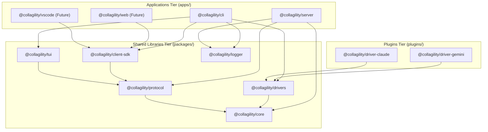
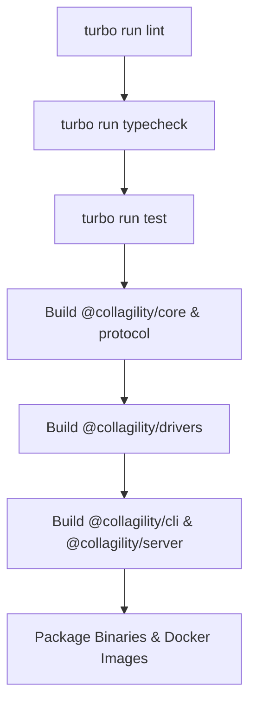
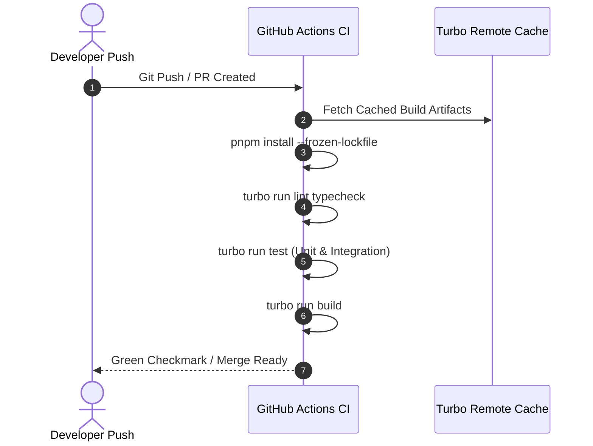
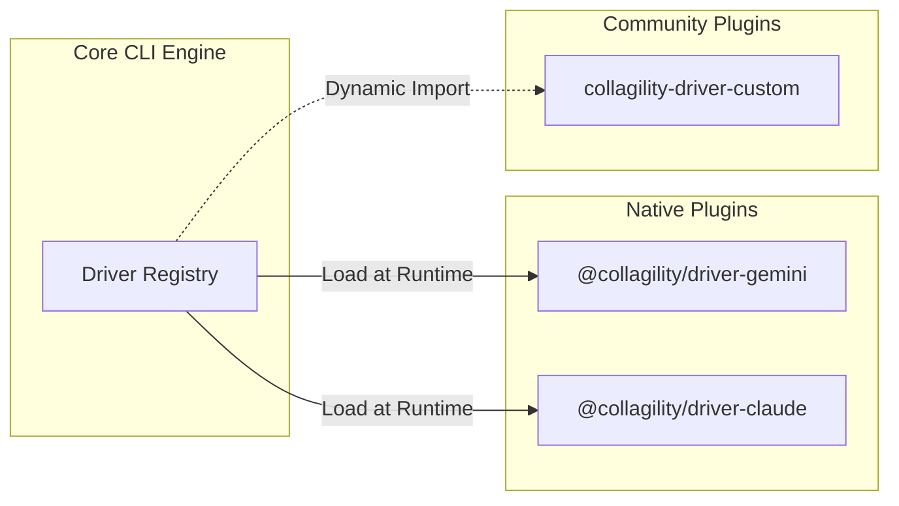

# RFC-0006: Monorepo Architecture & Package Strategy Specification

**Title:** Collagility Monorepo Architecture Specification (v1.0.0-draft)  
**Author:** Staff Software Architect  
**Status:** Draft / Proposal  
**Created:** July 2026  
**Target Tooling:** TypeScript, pnpm workspaces, TurboRepo, Fastify, Commander.js, Ink TUI  

---

## 1. Executive Summary

This document specifies the scalable monorepo architecture for **Collagility**, an open-source multiplayer workspace for local AI coding agents. 

As Collagility expands across multiple client form factors (CLI **(done)**, Web Application **(future)**, VS Code Extension **(future)**) and backend components (Relay Server **(done)**), a strict monorepo strategy is essential to prevent code duplication, enforce type safety across network boundaries, maintain build determinism, and streamline package publishing.

This specification details the pnpm workspace directory tree, package boundaries, dependency flow rules, shared configuration packages, plugin extensions, build pipelines, CI/CD stages, and version management strategy designed for long-term production scalability.

---

## 2. Repository Structure

The monorepo uses a modular multi-package structure organized into standard top-level workspaces: `apps/`, `packages/`, `tools/`, and `docs/`.

```
collagility/
├── .github/                       # GitHub Actions CI/CD workflows & automation templates (done)
├── apps/                          # Executable applications and entrypoint targets
│   ├── cli/                       # Terminal CLI binary application (@collagility/cli) (done)
│   ├── server/                    # Fastify WebSocket relay server (@collagility/server) (done)
│   └── web/                       # Next.js Web browser client SPA (@collagility/web) (future)
├── packages/                      # Core domain, shared libraries, and abstractions
│   ├── adapters/                  # Multi-provider AI process adapters (@collagility/adapters) (done)
│   ├── protocol/                  # WebSocket event schemas & serialization (@collagility/protocol) (done)
│   ├── sdk/                       # Unified WebSocket SDK for clients (@collagility/sdk) (done)
│   ├── stream/                    # Token chunking & stream assembler (@collagility/stream) (done)
│   └── types/                     # Shared TypeScript domain interfaces (@collagility/types) (done)
├── docs/                          # Architecture RFCs, user guides, API docs (done)
├── install.sh                     # Standalone quick installer script (done)
├── pnpm-workspace.yaml            # pnpm workspace configuration file (done)
├── turbo.json                     # TurboRepo build pipeline definition (done)
├── tsconfig.base.json             # Root TypeScript base configuration (done)
└── README.md                      # Project overview and quickstart (done)
```

---

## 3. Package Responsibilities

### 3.1 Executable Applications (`apps/`)

* **`apps/cli` (`@collagility/cli`):** The primary command-line binary. Uses Commander.js for CLI flag parsing and React/Ink for TUI rendering. Hosts local session drivers and handles terminal I/O streams.
* **`apps/server` (`@collagility/server`):** The stateless Fastify WebSocket and HTTP relay control plane. Manages authentication, room routing, Redis pub/sub fanout, and participant presence.
* **`apps/web` (`@collagility/web`):** Future Web Assembly / React web viewer enabling browser-based zero-install session observation.
* **`apps/vscode` (`@collagility/vscode`):** Future VS Code extension embedding Collagility session views into the IDE side-bar.

### 3.2 Core Packages (`packages/`)

* **`packages/core` (`@collagility/core`):** Contains framework-agnostic domain models (`Session`, `Participant`, `Workspace`), value objects, role policies, and application use cases. Zero external dependencies.
* **`packages/protocol` (`@collagility/protocol`):** Shared TypeScript types, JSON schemas, correlation utilities, and envelope serializers for the real-time WebSocket protocol (`collagility-v1`).
* **`packages/drivers` (`@collagility/drivers`):** Abstract `IAgentDriver` port definitions, process manager wrappers, and driver registry factory.
* **`packages/tui` (`@collagility/tui`):** Reusable React/Ink TUI components (side-chat, presence bar, prompt dialogs, ANSI stream view).
* **`packages/client-sdk` (`@collagility/client-sdk`):** High-level WebSocket client library encapsulating auto-reconnection, event ordering buffers, and RPC callbacks for non-CLI clients.

---

## 4. Dependency Graph

To maintain clean separation of concerns, dependencies MUST flow strictly from outer applications inward toward core domain packages. Circular dependencies between packages are strictly forbidden.



---

## 5. Shared Packages & Configuration

Shared development configurations are centralized under `tools/` and `packages/` to ensure consistent code styling, linting, and build settings across all workspace packages:

* **`tools/eslint-config`:** Exported ESLint rulesets (`@collagility/eslint-config/node`, `@collagility/eslint-config/react`).
* **`tsconfig.json` (Root Base):** Strict base TypeScript configuration shared via `extends: "@collagility/tsconfig/base.json"`.

---

## 6. Build System & Pipeline

Collagility uses **TurboRepo** combined with **pnpm** to deliver incremental builds, parallel execution, and aggressive remote caching.



### 6.1 `turbo.json` Pipeline Definition (Structure)
* `build`: Depends on `^build` (topological dependency ordering). Outputs `dist/**`.
* `test`: Depends on `build`. Runs unit and integration tests.
* `lint`: Runs ESLint across all workspaces in parallel.

---

## 7. Configuration Strategy

Workspace configurations follow a single-source-of-truth model:
* **Package Management:** `pnpm-workspace.yaml` declares package directories (`apps/*`, `packages/*`, `plugins/*`).
* **TypeScript Transpilation:** Project References (`tsc --build`) enable incremental type-checking without re-compiling unmodified dependencies.
* **Bundle Isolation:** CLI binaries are bundled into single standalone executables using `esbuild` to minimize startup cold-boot latency.

---

## 8. Testing Strategy

Collagility enforces a three-tiered testing hierarchy across the monorepo:

```
+-----------------------------------------------------------------------+
| 1. End-to-End Tests (Playwright / CLI Integration)                    |
|    - Test full session host, join, and stream loop across WebSockets. |
+-----------------------------------------------------------------------+
| 2. Integration Tests (Vitest + Redis/Fastify Containers)              |
|    - Test protocol framing, session state transitions, auth guards.   |
+-----------------------------------------------------------------------+
| 3. Unit Tests (Vitest)                                                |
|    - Test domain logic, driver adapters, and TUI component state.     |
+-----------------------------------------------------------------------+
```

---

## 9. CI Structure

Continuous Integration workflows are executed via GitHub Actions on every pull request and push to `main`.



---

## 10. Release Strategy & Versioning

Collagility adopts **Changesets** for automated package versioning and changelog generation.

* **Independent Versioning:** Core packages (`@collagility/core`, `@collagility/protocol`) maintain independent Semantic Versioning (SemVer: `MAJOR.MINOR.PATCH`).
* **CLI & Server Alignment:** Executive applications (`@collagility/cli` and `@collagility/server`) publish aligned release tags (e.g. `v0.1.0`).

---

## 11. Plugin System Architecture

To allow third-party developers to contribute AI provider drivers without modifying core codebase repositories, Collagility provides a pluggable driver discovery model:



* **Plugin Interface:** Plugins export a standard factory function returning an `IAgentDriver` instance.
* **Discovery Mechanism:** The CLI auto-detects installed npm packages matching the pattern `collagility-driver-*` or `@collagility/driver-*`.

---

## 12. Documentation Structure

All architecture documents and user manuals reside under `docs/`:

```
docs/
├── RFC-0001-VISION-AND-REQUIREMENTS.md
├── RFC-0002-HIGH-LEVEL-ARCHITECTURE.md
├── RFC-0003-WEBSOCKET-PROTOCOL-SPECIFICATION.md
├── RFC-0004-SESSION-LIFECYCLE-SPECIFICATION.md
├── RFC-0005-AI-ADAPTER-ARCHITECTURE.md
└── RFC-0006-MONOREPO-ARCHITECTURE-SPECIFICATION.md
```

---

## 13. Naming Conventions

* **Workspace Package Prefix:** All official monorepo packages use the `@collagility/` npm scope.
* **Directory Names:** Kebab-case (e.g., `client-sdk`, `driver-gemini`).
* **Source Files:** CamelCase for classes/components (`SessionController.ts`), camelCase for utilities (`serializeFrame.ts`).

---

## 14. Future Packages Expansion

As Collagility matures, the monorepo is designed to seamlessly incorporate the following planned packages:

* **`apps/desktop` (`@collagility/desktop`):** Tauri / Electron cross-platform desktop wrapper.
* **`plugins/driver-ollama` (`@collagility/driver-ollama`):** Local open-source model driver adapter.
* **`packages/crypto-e2ee` (`@collagility/crypto-e2ee`):** WebRTC Noise protocol end-to-end payload encryption package.

---
