# RFC-0007: Enterprise Security Architecture & Threat Model Specification

**Title:** Collagility Complete Security Architecture Specification (v1.0.0-draft)  
**Author:** Staff Software Architect & Chief Information Security Officer (CISO)  
**Status:** Draft / Proposal  
**Created:** July 2026  
**Security Framework Alignment:** Zero Trust Architecture (NIST SP 800-207), SOC 2 Type II, ISO/IEC 27001, GDPR  

---

## 1. Executive Summary

This document specifies the end-to-end Security Architecture and Threat Model for **Collagility**, the open-source multiplayer workspace for local AI coding agents. 

Because Collagility connects local developer environments across enterprise networks and bridges terminal processes with central event relays, it operates under a strict **Zero Trust Architecture (ZTA)** model: **no network, client, server, or user is inherently trusted**.

The primary security imperative of Collagility is **Local Compute & Credential Sovereignty**: AI model inferencing, source code execution, and AI vendor API credentials remain 100% isolated to the session owner's host machine. The central relay infrastructure acts exclusively as an authenticated, authorized, zero-knowledge event router.

This specification details authentication mechanics, fine-grained access control (ReBAC/ABAC), token lifecycles, WebSocket security, cryptographic envelope protection, rate limiting, anti-replay guards, AI safety filters, tamper-evident audit trails, disaster recovery, and a complete STRIDE threat analysis.

---

## 2. High-Level Security Architecture & Trust Boundaries

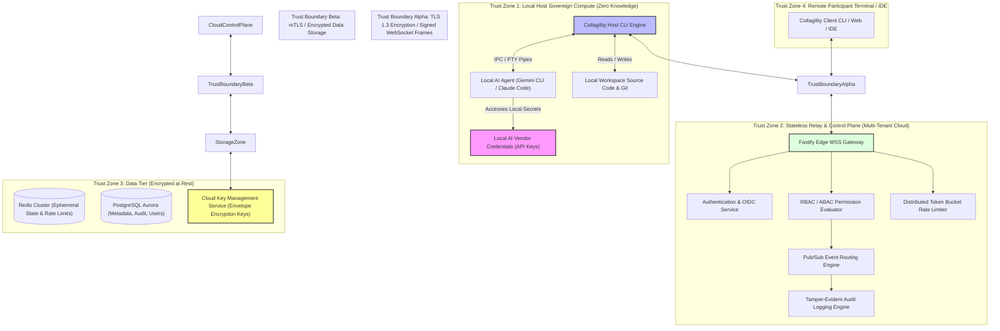

---

## 3. Data Flow Diagram (DFD) & Threat Surfaces

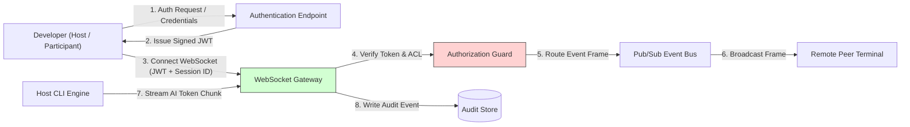

---

## 4. Authentication Architecture

### 4.1 Authentication Principles & Login Flows
1. **Passwordless & OIDC Federated Identity:** Eliminates static password storage risks. Supports GitHub OAuth2, Google OIDC, and Enterprise SAML 2.0 / Okta / Azure AD.
2. **Device Code Flow (RFC 8628):** Designed specifically for terminal CLI environments (`collagility login`). Generates a short verification code and user authentication URI for browser approval.
3. **Multi-Factor Authentication (MFA):** Enforced at the organization policy level using Time-based One-Time Passwords (TOTP) or FIDO2 / WebAuthn hardware keys.
4. **Device Trust & Binding:** Devices register public key pairs (`Ed25519`) during onboarding. Access tokens are bound to specific hardware device footprints.

### 4.2 Authentication Sequence Diagram

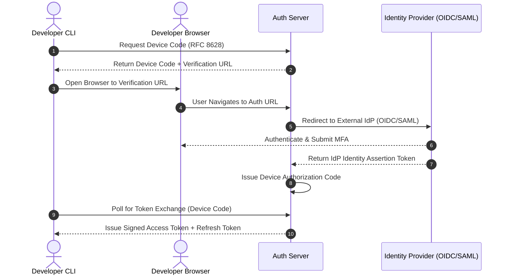

---

## 5. Authorization Architecture (RBAC + ABAC + ReBAC)

Collagility enforces a hybrid access control model combining **Role-Based Access Control (RBAC)** for administrative roles, **Attribute-Based Access Control (ABAC)** for dynamic context evaluation (IP range, device trust score, time), and **Relationship-Based Access Control (ReBAC)** for fine-grained workspace graphs.

### 5.1 Permission Evaluation Sequence Diagram

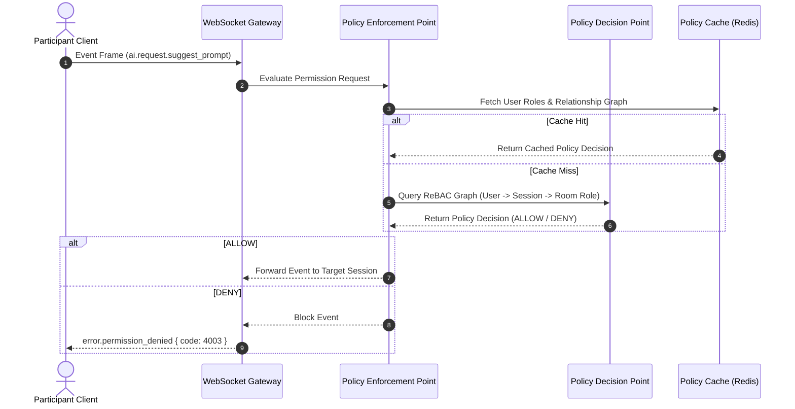

---

## 6. Scalable Permission Model & Hierarchy

The permission model enforces strict inheritance down the organizational hierarchy, with localized resource overrides.

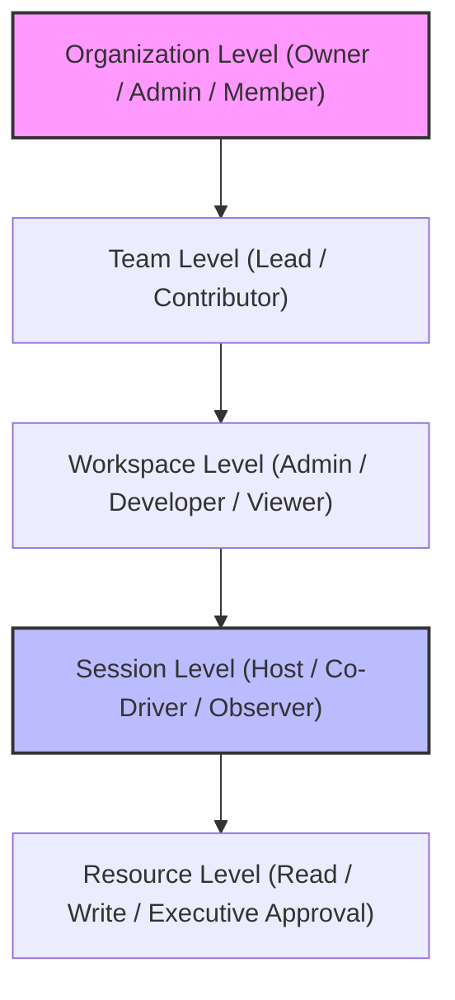

### 6.1 Role Permission Matrix

| Role | Scope | Create Session | Submit Prompts | Approve Commands | Invite Users | Audit Access |
| :--- | :--- | :--- | :--- | :--- | :--- | :--- |
| **Organization Owner** | Organization | Yes | Yes | Yes | Yes | Full |
| **Workspace Admin** | Workspace | Yes | Yes | Yes | Yes | Workspace |
| **Session Host** | Active Session | Yes (Owner) | Yes | **Exclusive** | Yes | Session |
| **Session Co-Driver** | Active Session | No | Yes (Host Validated) | No | No | Read-Only |
| **Session Observer** | Active Session | No | No (Read Only) | No | No | Read-Only |

---

## 7. Session Management & Token Architecture

### 7.1 Cryptographic Token Strategy
* **Short-Lived Access Tokens:** Cryptographically signed JSON Web Tokens (JWT) using `EdDSA` (`Ed25519`). Expiration: **15 minutes**.
* **Opaque Refresh Tokens:** High-entropy 256-bit cryptographically secure random strings stored as hashed values in PostgreSQL. Expiration: **7 days** with sliding window rotation.
* **Token Rotation & Theft Detection:** Every refresh token exchange revokes the previous token family chain if reuse of an old refresh token is detected (indicating token exfiltration).

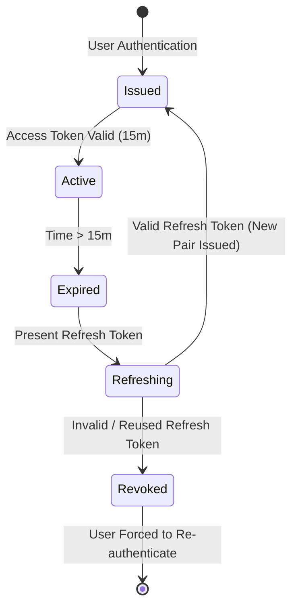

---

## 8. Invite Link Security & Onboarding

1. **High-Entropy Token Generation:** Session invite tokens are 256-bit cryptographically secure strings (`UUIDv4` + HMAC-SHA256 signature).
2. **One-Time & Max-Use Constraints:** Invites enforce configurable use caps (e.g., single-use peer links vs. multi-use team links).
3. **Strict Expiration:** Default expiration is **1 hour** for session join links; unused links automatically purge.
4. **Context-Bound Validation:** Links encode the specific Workspace ID and required role scope, preventing cross-tenant reuse attacks.

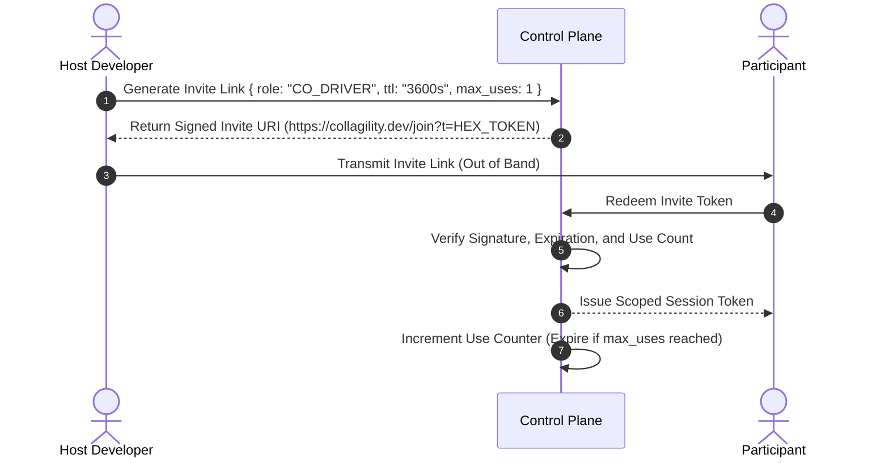

---

## 9. Replay Protection Architecture

To prevent malicious interceptors from re-transmitting WebSocket events or REST HTTP requests:

1. **Monotonic Sequence Numbers (`seq`):** Every WebSocket stream event carries an incrementing 64-bit sequence counter scoped to the room. Out-of-order or duplicate sequence numbers are dropped immediately.
2. **Cryptographic Nonces & Timestamps:** REST requests require `X-Signature`, `X-Timestamp`, and `X-Nonce` headers. Requests outside a $\pm 300\text{-second}$ clock window or containing previously seen nonces are rejected.
3. **Ephemerality of Stream Tokens:** AI stream chunks carry ephemeral stream identifiers valid only for the duration of the current execution frame.

---

## 10. WebSocket & Broadcast Security

1. **Origin Header Validation:** Server strictly enforces allowed CORS/Origin domain matching to prevent Cross-Site WebSocket Hijacking (CSWSH).
2. **Connection Authentication:** WebSocket upgrade requests require valid JWT bearer tokens passed via `sec-websocket-protocol` or short-lived connection tickets.
3. **Broadcast Role Isolation:** The pub/sub relay router filters outgoing room channels. Events containing private host diagnostic metrics are stripped before fan-out to Observer participants.

---

## 11. Denial-of-Service (DoS) & Rate Limiting Architecture

Collagility implements a multi-tier distributed rate-limiting architecture powered by Redis sliding-window algorithms.

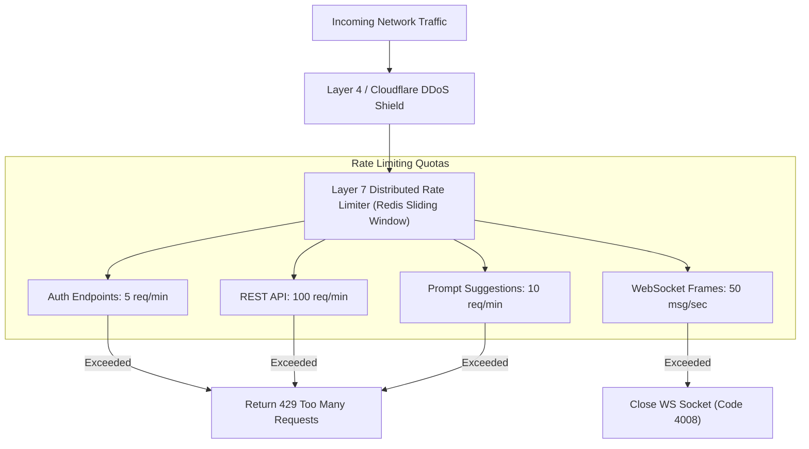

---

## 12. Owner Verification & Sensitive Action Guards

Critical administrative operations (e.g., Workspace Deletion, Transfer Ownership, Billing Changes, Global Security Rule Updates) require **Step-Up Re-Authentication**:

* **Interactive Challenge:** Prompt user for WebAuthn hardware key touch or TOTP code.
* **Dual-Control Approval (Multisig for Enterprise):** Option for high-security workspaces requiring two distinct Organization Owners to approve workspace deletion.

---

## 13. Cryptographic Architecture & Secrets Management

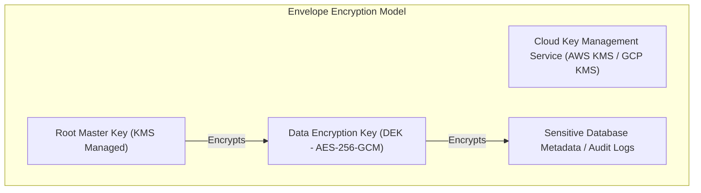

### 13.1 Encryption Standards
* **Data in Transit:** TLS 1.3 enforced across all HTTP/WSS channels. Cipher suites restricted to modern AEAD ciphers (`TLS_AES_256_GCM_SHA384`, `TLS_CHACHA20_POLY1305_SHA256`).
* **Data at Rest:** All databases, caches, and persistent volumes encrypted using AES-256-GCM envelope encryption.
* **Local Secrets Isolation:** Host AI API keys reside solely in local system keychains (macOS Keychain, Linux Secret Service, Windows Credential Manager).

---

## 14. AI Security, Safety & Tenant Isolation

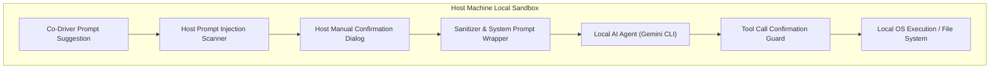

1. **Prompt Injection & Jailbreak Defense:** Input prompt suggestions from non-host participants are sanitized and scanned for prompt injection signatures prior to display in the host approval window.
2. **Host Sovereignty & Tool Execution Guard:** The AI agent CANNOT execute terminal commands or write local files without explicit, interactive host confirmation.
3. **Context Isolation:** Participants cannot view workspace files outside the explicit context bundle assembled by the host.

---

## 15. Secure Logging & Tamper-Evident Audit Trail

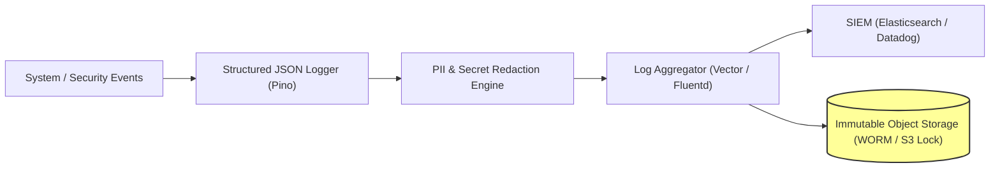

* **Tamper-Resistance:** Audit logs are written to Write-Once-Read-Many (WORM) cloud storage with cryptographic hash-chaining (HMAC SHA-256 log blocks).
* **Privacy & Redaction:** Automated regex filters scrub passwords, JWT tokens, IP addresses (pseudonymized), and personal secrets before log emission.

---

## 16. Disaster Recovery & Resilience Architecture

| Requirement | Target Metric | Architectural Strategy |
| :--- | :--- | :--- |
| **Recovery Point Objective (RPO)** | $< 1\text{ minute}$ | Continuous WAL shipping for PostgreSQL; multi-region Redis replication. |
| **Recovery Time Objective (RTO)** | $< 5\text{ minutes}$ | Automated multi-region DNS failover; stateless Fastify container auto-scaling. |
| **Backup Frequency** | Hourly Incremental, Daily Full | Automated encrypted snapshots replicated to secondary geographic region. |

---

## 17. STRIDE Threat Model & Risk Assessment

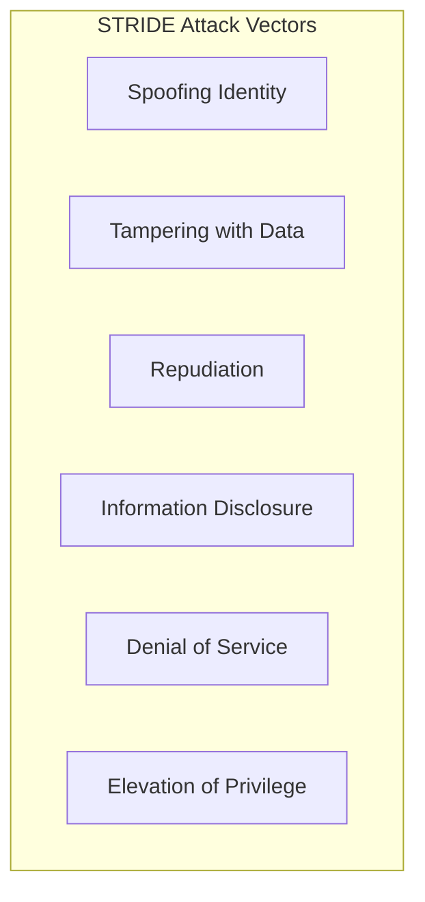

### 17.1 STRIDE Threat Analysis Matrix

| Threat Category | Specific Threat Surface | Impact | Architectural Mitigation Strategy | Risk Rating |
| :--- | :--- | :--- | :--- | :--- |
| **Spoofing** | Adversary impersonates host to join session. | High | Cryptographic device binding; JWT signed with EdDSA; short-lived join tokens. | Low |
| **Tampering** | Man-in-the-middle modifies AI stream tokens. | High | TLS 1.3 transport encryption; WebSocket sequence numbers (`seq`); SHA-256 HMACs. | Low |
| **Repudiation** | User denies submitting destructive prompt. | Medium | Tamper-evident, WORM-locked audit trail capturing signed user event IDs. | Low |
| **Information Disclosure** | Relay server compromise leaks code context. | Critical | **Zero-Knowledge Architecture:** Host code context is never stored on backend servers. | Critical (Mitigated to Low) |
| **Denial of Service** | Socket flooding attacks on relay nodes. | Medium | Layer 7 distributed sliding-window rate limiting; Cloudflare DDoS protection. | Medium |
| **Elevation of Privilege** | Observer gains Co-Driver or Host privileges. | High | Server-side ReBAC permission enforcement on every event frame. | Low |

---
