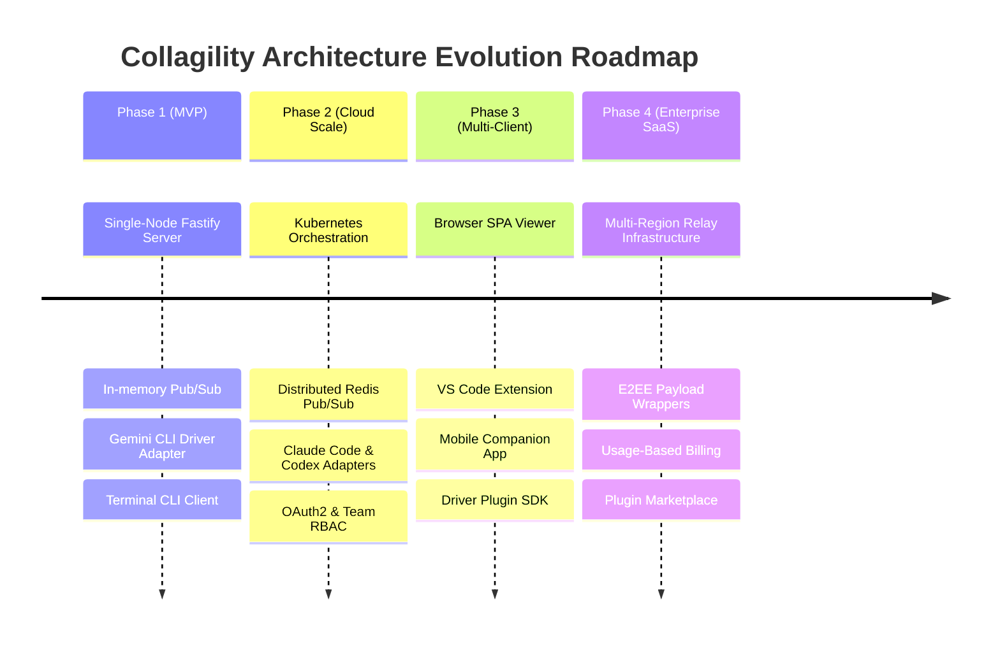
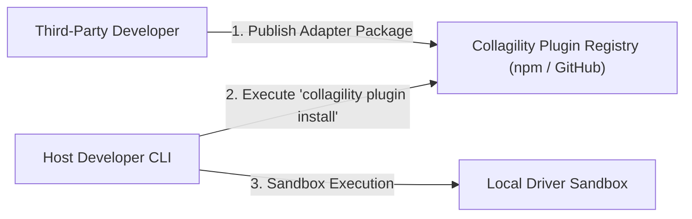
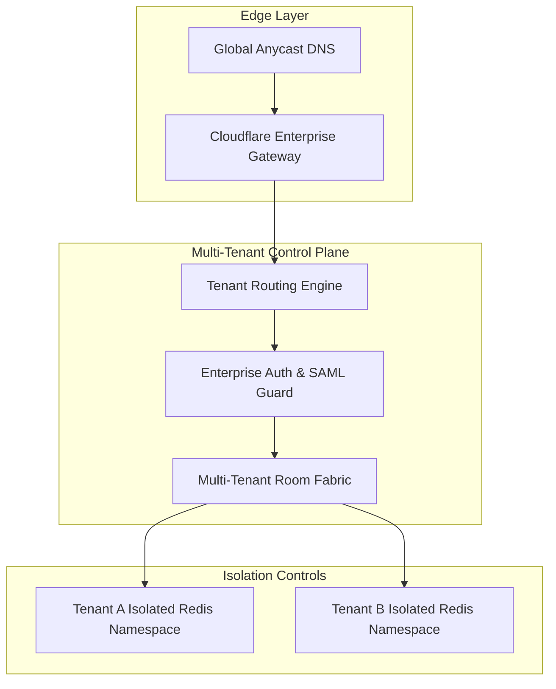
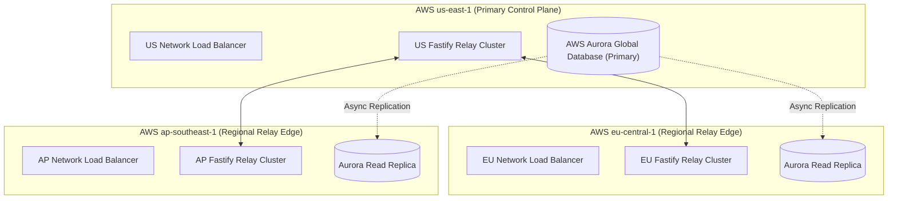

# RFC-0008: Platform Evolution, Scaling Architecture & Strategic Roadmap Specification

**Title:** Collagility Platform Evolution & Enterprise Scaling Roadmap (v1.0.0-draft)  
**Author:** Staff Software Architect & VP of Engineering  
**Status:** Draft / Proposal  
**Created:** July 2026  
**Evolution Span:** Single-Node Open Source MVP $\longrightarrow$ Globally Distributed Enterprise SaaS  

---

## 1. Executive Summary

This document specifies the architectural evolution trajectory for **Collagility**, detailing how the platform transforms from an initial single-server, self-hosted open-source utility into a highly available, multi-region, enterprise-grade SaaS ecosystem.

As developer adoption grows from local pairing sessions to global enterprise engineering squads, Collagility's infrastructure must scale horizontally across several dimensions: persistent WebSocket connection multiplexing, distributed Redis Pub/Sub state management, Kubernetes container orchestration, multi-tenant billing models, IDE extension integrations, and multi-region data routing.

Crucially, throughout every evolutionary phase, Collagility adheres to its foundational architectural invariant: **Local Compute Sovereignty**. The cloud control plane scales relay traffic and collaboration metadata without ever centralizing AI model inferencing, source code storage, or LLM credentials.

---

## 2. Platform Evolution Phases

The evolution of Collagility spans four major architectural milestones:

```
[Phase 1: Single-Node MVP] ──> [Phase 2: Cloud Native & Scale] ──> [Phase 3: Multi-Client Ecosystem] ──> [Phase 4: Global Enterprise SaaS]
(Self-Hosted Docker)            (K8s / Redis Cluster)             (Web / VS Code / IDEs)            (Multi-Region / E2EE / Marketplace)
```



---

## 3. Scaling WebSockets & Connection Multiplexing

### 3.1 The WebSocket Scaling Challenge
A single Node.js process using standard socket listeners can typically maintain ~10,000–20,000 idle TCP connections before encountering operating system file descriptor limits (`ulimit`) or memory saturation. To support hundreds of thousands of concurrent active developers, Collagility employs a stateless multi-tier socket architecture.

### 3.2 WebSocket Load Balancing Strategy
Layer 4 / Layer 7 Load Balancers (AWS NLB / Cloudflare) terminate TLS and route incoming WebSocket HTTP Upgrade requests across a pool of stateless Fastify relay pods using consistent hashing on `session_id`.

```mermaid
graph TD
    ClientPool["100,000+ Concurrent Developer Clients"] --> L7LB["AWS NLB / Cloudflare Edge (Layer 4/7)"]
    
    subgraph Stateless Relay Pod Pool (Kubernetes Cluster)
        Pod1["Fastify Relay Pod 1 (Connections: 15,000)"]
        Pod2["Fastify Relay Pod 2 (Connections: 15,000)"]
        PodN["Fastify Relay Pod N (Connections: 15,000)"]
    end

    subgraph Messaging Fabric
        RedisPubSub[("Redis Cluster Pub/Sub Shards")]
    end

    L7LB --> Pod1
    L7LB --> Pod2
    L7LB --> PodN

    Pod1 <--> RedisPubSub
    Pod2 <--> RedisPubSub
    PodN <--> RedisPubSub
```

---

## 4. Distributed Redis Architecture & Pub/Sub Sharding

To prevent single-node bottlenecks, room events are sharded across an ElastiCache Redis Cluster using Redis Sentinel / Cluster mode:

1. **Pub/Sub Channel Sharding:** Channels follow the key template `room:{session_id}`. Redis Cluster automatically assigns rooms to specific hash slots ($0 \text{ to } 16383$).
2. **Ephemeral Presence Storage:** Participant presence and ping timestamps are stored as Redis Hashes with strict TTL key expirations (30 seconds).
3. **Sequence Buffering:** Replay buffers (`lastSeq` frames) are kept in circular Redis sorted sets (`ZADD` scored by sequence number), capping storage overhead per session.

---

## 5. Horizontal Scaling & Kubernetes Orchestration

```mermaid
graph TB
    subgraph Kubernetes Cluster (AWS EKS / GCP GKE)
        HPA["Horizontal Pod Autoscaler (HPA)"] --> Deployment["Fastify Server Deployment"]
        
        subgraph Pod Instances
            PodA["Pod A (CPU: 45%, WS: 8k)"]
            PodB["Pod B (CPU: 50%, WS: 9k)"]
            PodC["Pod C (CPU: 12%, WS: 1k)"]
        end

        Deployment --> PodA
        Deployment --> PodB
        Deployment --> PodC
    end

    Metrics["Prometheus WS Connection & CPU Metrics"] --> HPA
```

### 5.1 Autoscaling Metrics & Rules
* **Scale-Out Trigger:** HPA triggers pod creation when average WebSocket connection count exceeds **12,000 per pod** or CPU utilization exceeds **65%**.
* **Graceful Pod Termination (Drain Window):** When scaling down, pods enter a 120-second drain state. The pod stops accepting new connections and sends a `system.reconnect_notice` frame to active sockets, instructing clients to migrate to other healthy pods via exponential jitter backoff.

---

## 6. Self-Hosted Open Source vs. Managed Cloud SaaS

| Architecture Dimension | Self-Hosted Open Source (v0.1) | Managed Cloud Enterprise SaaS (v1.0+) |
| :--- | :--- | :--- |
| **Deployment Model** | Single Docker Compose container. | Multi-tenant Kubernetes / Multi-Region Cloud. |
| **Relay Backend** | Embedded SQLite / Local Redis. | AWS Aurora PostgreSQL + ElastiCache Cluster. |
| **Auth Engine** | Simple API keys or local tokens. | Enterprise SAML 2.0 / Okta / Azure AD OIDC. |
| **Network Footprint** | Direct IP / Local LAN / Ngrok tunnel. | Global Anycast DNS / Edge TLS Termination. |
| **Data Sovereignty** | 100% On-Premises. | Zero-Knowledge Relay; E2EE payload option. |

---

## 7. Multi-Client Ecosystem Expansion

To eliminate terminal-only restrictions, Collagility expands across desktop, browser, and IDE interfaces while maintaining protocol parity.

```mermaid
graph TD
    subgraph Collagility Protocol Core (@collagility/protocol)
        SDK["@collagility/client-sdk"]
    end

    subgraph Client Form Factors
        CLIApp["Terminal CLI (Commander.js + Ink)"]
        BrowserApp["Web SPA (React + WebAssembly)"]
        VSCodeExt["VS Code Extension (TypeScript)"]
        MobileApp["Mobile Companion (React Native)"]
    end

    CLIApp --> SDK
    BrowserApp --> SDK
    VSCodeExt --> SDK
    MobileApp --> SDK
```

### 7.1 Client Integrations Strategy
1. **VS Code Extension (`apps/vscode`):** Embeds live session presence, co-prompting input, and diff previews directly inside the editor side-bar. Interacts with the host's local CLI process via IPC pipes.
2. **Web Browser Client (`apps/web`):** Uses Xterm.js / WebAssembly to render real-time session streams for observers who do not have CLI binaries installed.
3. **Mobile Companion App (`apps/mobile`):** iOS/Android app allowing team leads to approve tool executions or participate in side-chat while away from their primary workstation.

---

## 8. Extensible Driver Plugin Marketplace Architecture

The Plugin Marketplace enables third-party developers to publish, discover, and install custom AI provider adapters safely.



### 8.1 Plugin Security Isolation & Verification
* **Static Analysis Verification:** Marketplace plugins undergo automated security auditing for malicious network calls or file system traversal vulnerabilities.
* **Process Sandboxing:** Third-party driver plugins execute in restricted Node.js worker threads with stripped environment access.

---

## 9. Multi-Tenant Enterprise SaaS Architecture



---

## 10. Multi-Region Deployment Architecture

To achieve low-latency event fanout ($\le 30\text{ ms}$) worldwide, relay server clusters are deployed across US-East, EU-Central, and AP-Southeast regions.



---

## 11. Multi-Tenant Billing & Metering

1. **Seat-Based Licensing:** Tiered billing calculated on active monthly unique users per Organization.
2. **Metering & Telemetry (No Content Capture):** The control plane meters session duration, participant count, and message throughput without capturing prompt content or code diffs.
3. **Stripe Integration:** Synchronizes subscription tiers, seat updates, and usage invoices automatically via Stripe Webhooks.

---

## 12. Strategic Multi-Year Feature Roadmap

```
+-----------------------------------------------------------------------------------+
| MILESTONE 1 (v0.1.0 - v0.5.0): OPEN SOURCE FOUNDATION                             |
| - Core CLI Host & Client (`collagility host`, `collagility join`).                |
| - Production-grade Gemini CLI Driver Adapter.                                     |
| - Single-node Fastify WebSocket Relay Server with Docker Compose.                 |
+-----------------------------------------------------------------------------------+
                                         │
                                         ▼
+-----------------------------------------------------------------------------------+
| MILESTONE 2 (v0.6.0 - v1.0.0): CLOUD SCALE & MULTI-AGENT                          |
| - Redis Pub/Sub cluster sharding & Kubernetes HPA support.                        |
| - Claude Code and OpenAI Codex CLI adapters.                                      |
| - GitHub / Google OAuth2 & Team Workspace Management.                             |
+-----------------------------------------------------------------------------------+
                                         │
                                         ▼
+-----------------------------------------------------------------------------------+
| MILESTONE 3 (v1.1.0 - v2.0.0): MULTI-CLIENT ECOSYSTEM                             |
| - Official VS Code Extension & JetBrains IDE Plugin release.                      |
| - WebAssembly / Xterm.js Browser Observer SPA.                                    |
| - Plugin SDK & Marketplace registry launch.                                       |
+-----------------------------------------------------------------------------------+
                                         │
                                         ▼
+-----------------------------------------------------------------------------------+
| MILESTONE 4 (v2.1.0+): ENTERPRISE SAAS & E2EE                                     |
| - Multi-Region AWS/GCP Edge deployment.                                           |
| - End-to-End Encryption (E2EE) using WebRTC Noise Protocol key exchange.          |
| - Enterprise SAML 2.0 / Okta SSO, Audit Export, & SOC 2 Compliance.               |
+-----------------------------------------------------------------------------------+
```

---

## 13. Tradeoffs and Architectural Decisions

| Decision Area | Chosen Path | Rejected Alternative | Strategic Tradeoff Rationale |
| :--- | :--- | :--- | :--- |
| **State Management** | Redis Pub/Sub Sharding | Kafka / RabbitMQ Event Streams | Redis provides sub-millisecond Pub/Sub delivery required for real-time streaming, with lower operational complexity. |
| **Data Sovereignty** | Local Host Compute Only | Cloud AI Proxying | Eliminates cloud API key storage liabilities and codebase privacy risks at the cost of requiring local CLI installation. |
| **Network Transport** | Stateful WebSockets over TLS | Pure gRPC / HTTP2 Streams | WebSockets provide universal browser and terminal compatibility without proxy traversal issues. |
| **Plugin Isolation** | Node Worker Sandbox | Docker-in-Docker Sandboxing | Worker threads drastically reduce memory footprint and startup overhead while maintaining driver safety boundaries. |

---
