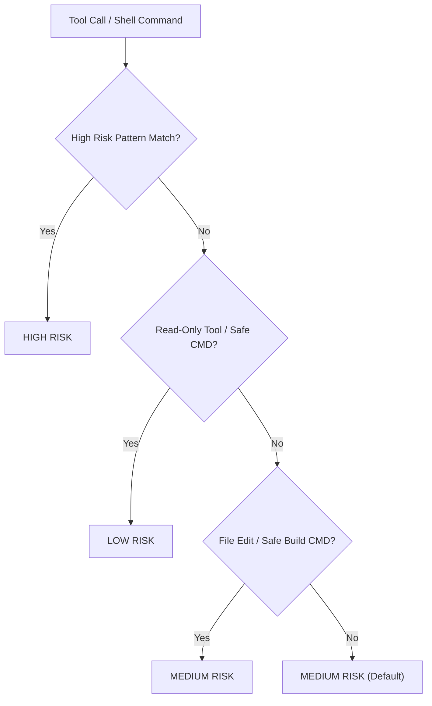
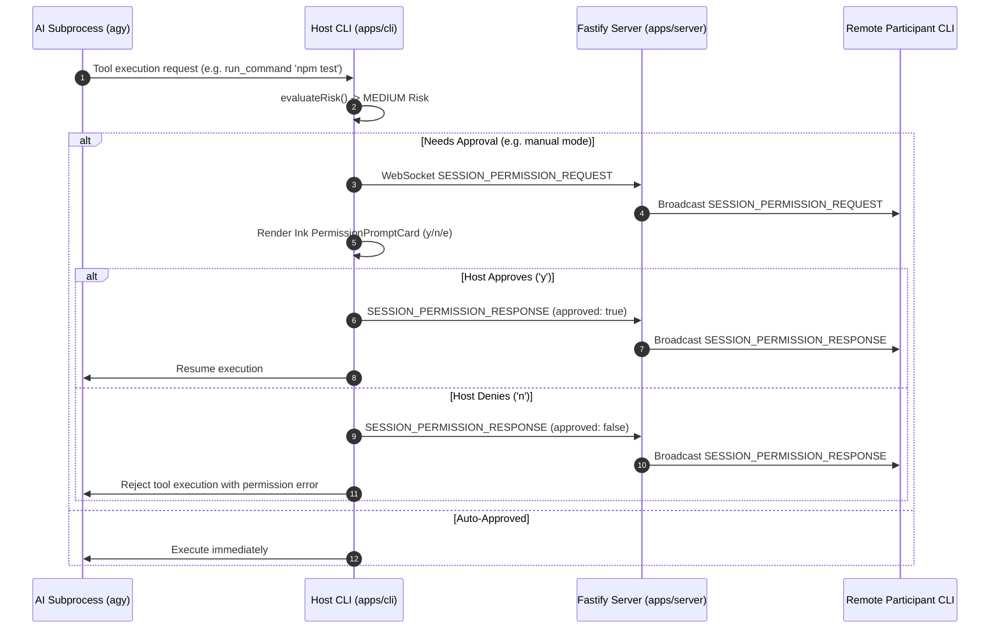

# RFC-0009: Security Risk Evaluation & Permission Engine Specification

**Title:** Collagility — Security Risk Evaluation Engine & Multi-User Permission Protocol  
**Author:** Lead Security Architect  
**Status:** Approved  
**Created:** August 2026  
**Target Packages:** `@collagility/adapters`, `@collagility/cli`, `@collagility/protocol`, `@collagility/server`  

---

## 1. Executive Summary

Collagility enables multi-user AI pair programming where local AI coding agents (`agy`, `gemini`, `claude`) execute tool calls, file mutations, and terminal commands. To protect host machines from unauthorized, destructive, or malicious operations during multiplayer sessions, Collagility implements a host-enforced **Security Permission Engine** paired with automated **Command Risk Classification**.

This RFC documents:
1. Command Risk Classification (`LOW`, `MEDIUM`, `HIGH`) implemented in `risk-evaluator.ts`.
2. Security Mode policies (`manual`, `accept-edits`, `plan-only`, `auto`).
3. The `PERMISSION_REQUIRED` lifecycle and WebSocket synchronization.

---

## 2. Command Risk Classification (`risk-evaluator.ts`)

Every tool call and shell command string is evaluated by `evaluateRisk(command, toolName)`:

### Risk Level Definitions

1. **`HIGH` Risk**:
   - Destructive command patterns: `rm -rf`, `rm -f`, `rm -r`.
   - System privilege escalation: `sudo`, `su`, `chmod`, `chown`, `chgrp`.
   - Process manipulation & disk formatting: `kill`, `pkill`, `dd`, `mkfs`, `format`.
   - System path mutation: direct writes to `/etc`, `/usr`, `/var`, `/boot`.
   - Remote script execution: `curl ... | bash`, `wget ... | sh`.
   - Path traversal attempts: `../` targeting outside workspace boundaries.

2. **`LOW` Risk**:
   - Read-only tools: `view_file`, `read_file`, `list_dir`, `ls`, `grep_search`, `search_web`.
   - Safe CLI commands without pipes or redirects: `git status`, `git log`, `git diff`, `pwd`, `node --version`.

3. **`MEDIUM` Risk**:
   - Project file creation and editing: `write_to_file`, `replace_file_content`, `multi_replace_file_content`.
   - Package operations & build commands: `mkdir`, `touch`, `cp`, `mv`, `npm install`, `pnpm build`.

---

## 3. Security Mode Enforcement Matrix

| Mode | `LOW` Risk Action | `MEDIUM` Risk Action | `HIGH` Risk Action |
| :--- | :--- | :--- | :--- |
| `manual` | Prompt Host (`y`/`n`/`e`) | Prompt Host (`y`/`n`/`e`) | Prompt Host (`y`/`n`/`e`) |
| `accept-edits` | Auto-Approve | Auto-Approve | Prompt Host (`y`/`n`/`e`) |
| `plan-only` | Auto-Approve | Block / Deny | Block / Deny |
| `auto` | Auto-Approve | Auto-Approve | Prompt Host (`y`/`n`/`e`) |

---

## 4. Permission Request Lifecycle over WebSockets

---

## 5. Security Guarantees

1. **Host Execution Sovereignty**: Remote session participants can chat and request actions, but only the session **Host machine** can resolve permission prompts and grant execution privileges.
2. **Zero Remote Escapes**: Destructive actions (`HIGH` risk) strictly prompt the host regardless of peer actions or automated mode shortcuts.
